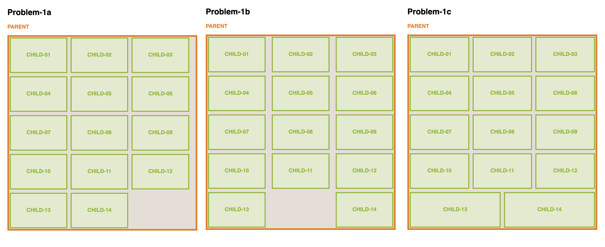
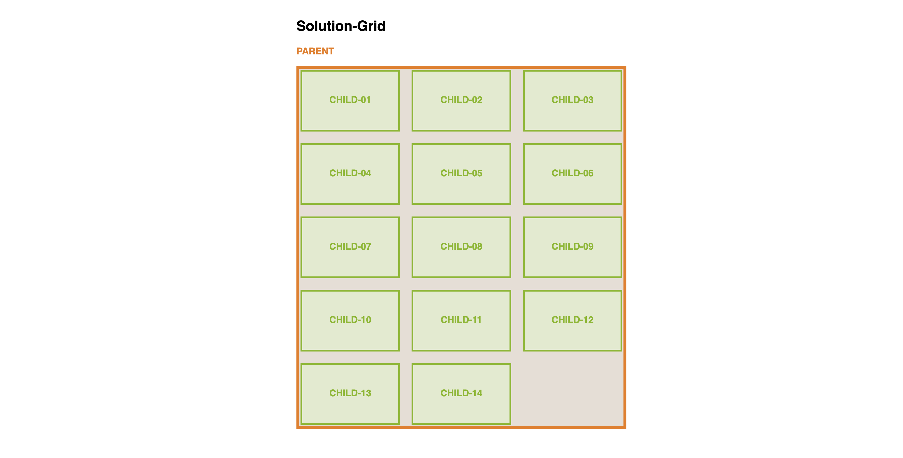
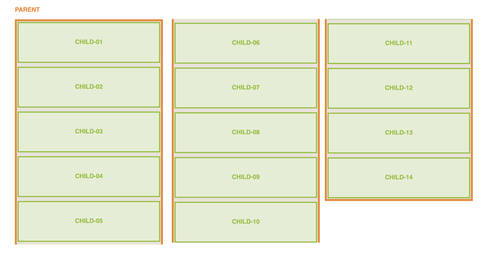
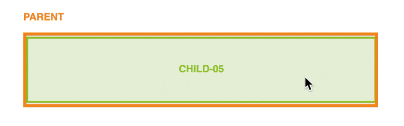
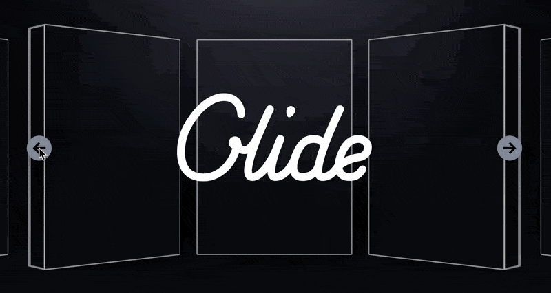

[TOC]

## Problem-1: odd looking last row....

### Problem

This issue appear to be most common for me, when having items wrapping in a flex layout, the look of the last row is always somwhat non ideal (assuming you are using `flex-direction:row`): 

-   **Problem-1a**: If you would want all the childrens in the same column to align up, then you may face the condition where the last column of have a bigger right gutter then the remainder of the columns; (see: [screenshot](2024-12-19T215837.png) or [file](problem-1a.html)) 
-   **Problem-1b**: If you come from problem-1a and solves it with `justify-content:space-between`, then the problem of the big gutter for last column will be fixed, however the gutter in the middle seems to get to big, and the last row have a empty space in the middle (see: [screenshot](2024-12-19T215823.png) or [file](problem-1b.html))
-   **Problem-1c**: if you come from problem-1b and solves it with `flex-grow:1`, congratulations you solved all the probelm in 1a and 1b, but then again, the last column looks over-sized and doesn't quite fit in the morder design styles. (see: [screenshot ](2024-12-19T220045.png)or [file](problem-1c.html))

Of course you may play around and fix it with many method, to name a few: 

-   **Solution-1**: by pixel matching `gap` and `flex-basis` using `calc`  (see: [screenshot](2024-12-19T221133.png) or [file](problem-1-solution-1.html))
-   **Solution-2**: by adding `margins` to `:last-of-type`/`:nth-of-type(3n)`  (see [screenshot](2024-12-19T222601.png) or [file](problem-1-solution-2.html))

But the above solution, will only work for one breakpoint, you will need to do repeat this for every breakpoint. Generally speaking this issue seem to bother me every time, and I don't seem to find a pattern on how to resolve it completely. 

### Solution

The best way to solve it is to use a grid layout instead of a flex layout (there's this quote I found meaningful from [Coding2GO's video](https://www.youtube.com/watch?v=qJpA6qiJoWs): "**If it looks like a grid, then use CSS Grid!**"); With `flex` layout only have control over one axis of the flow direction (main-axis), whereas with `grid` layout you have strict and explicit control over both main-axis and cross-axis. (see [screenshot](2024-12-19T223521.png) or [file](problem-1-solution-grid.html))

## Problem-2: Infinite Scrolling on Mobile

### Problem

This is one also happens very common, but can be easily over-looked. Usually when the device width get very small, to fit all the content of the child without  wrapping to heavily, it is common to set with to 100% for child when device reaches certain break-point (e.g. `@media (max-width:768px){.child{flex-basis:100%}}`). Though this approach isn't flawed in its styling, user experience wise it is not idea; Because unless you are working on a image gallery, a user is likely only want to skim at a portion of the cards along with its parent, but not having to go through all of the cards before getting to the other page content.

### Solution

You may resolve it via using `overflow-x` + `scroll-snap` as shown in  [Coding2GO's video](https://www.youtube.com/watch?v=qJpA6qiJoWs), see below (or [file](problem-2-solution-1.html)): 

Or via external library such as [slick-slider](https://kenwheeler.github.io/slick/), [glide.js](https://glidejs.com/) or [reveal.js](https://revealjs.com/#/1) to achieve the carousel effect through javascript: 

## Reference

-   https://www.youtube.com/watch?v=qJpA6qiJoWs
-   https://kenwheeler.github.io/slick/
-   https://revealjs.com/#/1
