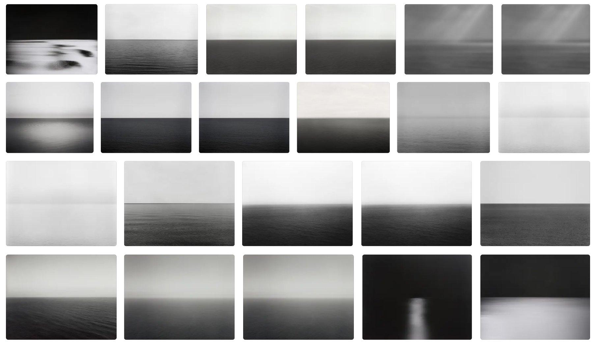

今年九月，我有幸在悉尼的MCU参观了杉本博司的《时间机器》（Time Machine）摄影展。杉本的作品挑战了摄影的传统界限，邀请观众与时间、记忆和存在的本质进行互动。他的技法通常涉及长时间曝光，创造出既空灵又引人深思的图像。

这是我第一次亲自参观摄影大师的系列展览。参观后，我心中一直萦绕着一个问题：杉本博司的知名作品在网上通常只有几幅，但在展览中，每个系列的图片实际上有很多幅。后来我在网上查找他的作品资源，发现同一个构图和影调的照片竟有十多张。这些照片在主体和环境的比例、拍摄角度乃至曝光方面基本一致。虽然我明白摄影是一个没有所谓抄袭或复制的领域，毕竟各种设置的组合很可能在历史上已被尝试过。作为现代人，我们拍摄的照片即使再有创意，也很难是全世界第一个拍这类照片的人。然而，这种单纯的重复，尤其是构图的相似，真的能拍出“好”的照片吗？复制他人的漂亮构图是否可以提升我单张图片的质量？

我认为自己尚未达到那个水平，因此不打算给出自己的结论。接下来，我将收集一些网上大家的意见，希望能为大家提供参考

## 正面评价
- **构图基础价值**：对于初学者来说，掌握基本构图规则如三分法、引导线等，可以帮助创作出更有平衡感和视觉吸引力的作品。多种构图准则的结合使用（如三分法结合引导线）能够强化照片的表现力。
- **构图的实用性**：这些构图方法简单易用，已在实际生活中被广泛应用，即使没有明确定义也能产生效果。通过基本的构图设定和技巧运用，可以实现非常好的摄影效果。
- **历来大师观点**：
  - 布列松派 （亨利·卡蒂埃·布列松）： 认为好的照片构图就是”几何图形“；提出”重叠正方形”构图法，将画面切割成两个重叠的正方形；强调对角线构图，主体通常落在对角线上。
  - 现代派（克雷格·赖利）： 善于将多种构图元素组合使用，如光影分割、视觉引导线、剪影等； 认为构图元素的组合就像建筑材料，可以搭建出不同形态的视觉效果。
  - 现代派（亚历克斯·韦伯）：将画面填满但不重叠；主张通过有序的混乱来创造层次感；认为构图需要与世界合作，包括光线、场景、人物等所有元素。
  - 极简派（劳拉）：擅长运用城市元素和极简美学；注重简单细节和对称美学的堆砌。

## 负面评价
- **过度的机械化**：过分依赖固定的构图模式可能会限制创作的自由度和创新性；单纯堆砌构图技巧而忽视画面内容的表达,容易使作品缺乏深度和情感
- **表达的局限性**：仅仅依靠构图规则无法保证创作出优秀的作品,还需要考虑光线、色彩、情感等多个层面；过度追求构图的完美可能会使画面显得刻意和生硬,失去自然感和真实感
- **历来大师观点**：
  - 布列松派 （亨利·卡蒂埃·布列松）： 等待”决定性瞬间”，反对刻意安排。
  - 现代派（亚历克斯·韦伯）：构图不应该是刻意堆砌，而是要”与世界合作”；好的摄影作品需要与光线、场景、人物等所有元素自然配合。
  - 纪实派（萨尔加多）：即使拍摄灾难题材，也要保持画面的自然美感；反对为了构图而刻意安排场景。

## 综合评价
- 构图规则应该作为创作的参考和工具,而不是限制创作自由的枷锁。真正优秀的摄影作品需要在技术和艺术表达之间找到平衡
