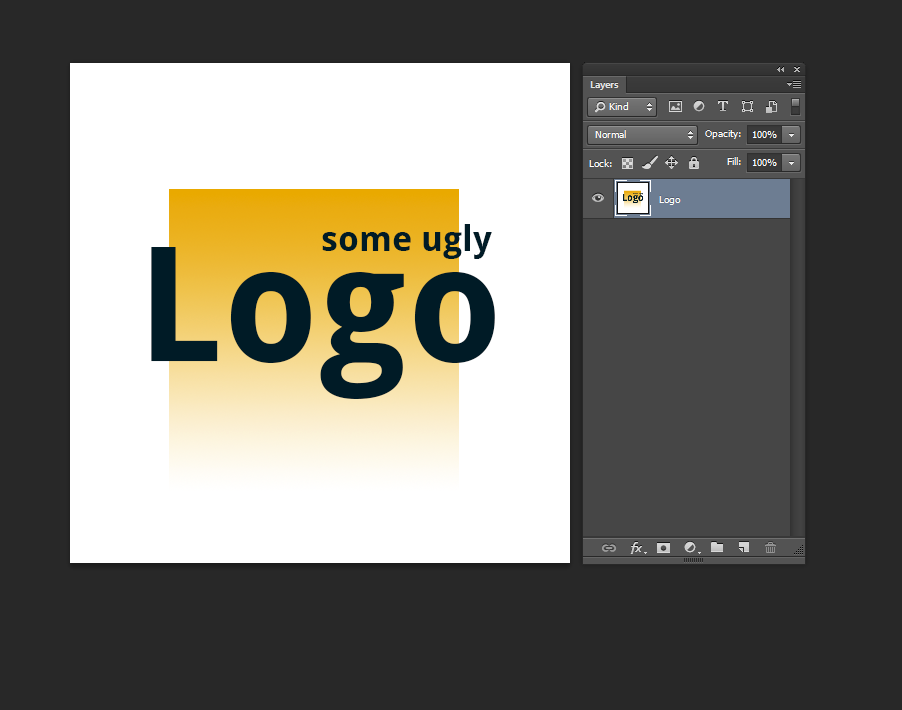
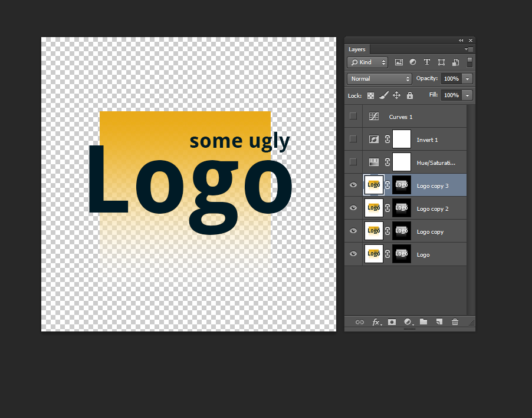

## Intuition

Got a client photo, he would like use it for both header and footer, but he only provided the light version of the image to use on the white background header, but not the inverted+transparent version of which used on footer. Instead of going forward-and-backward email asking him for the asset, I believe it is better to spend a few minutes of mine and create the inverted+transparent version myself.

## Step-by-Step

Start with your flattened image:

Add a **Saturation/Hue** adjustment layer and turn down the Saturation until the image has no color. If you don't have any gradient in your original image, you can just use a **Threshold** adjustment layer instead, which will result in 100% black or 100% white results.

(Technically you could skip step, as we'll be pasting it into a layer mask which will convert it to greyscale anyway. This will give you a good visual reference though to tweak the black/white balance)

Add an **Invert** adjustment layer, then a **Curves** adjustment layer. Tweak the Curves until everything you'd like to be solid/opaque is white, and everything you want fully transparent is black. You may have to tweak this a few times to get the amounts right.

Now CTRL+A to select the entire image and CTRL+SHIFT+C to copy the combined greyscale result. Create a layer mask on your original layer. Now ALT+Click in the layer mask icon to enter direct edit mode. Now paste the black and white image you just copied into there.

Now click back on your original layer to exit the layer mask direct edit and hide all your adjustment layers.

There you have it! If you find your finished result isn't fully opaque (solid) in the areas you like it, you can either tweak the curves and do it again (you'll need more white in those areas), or just duplicate the result/layer a few times until it becomes less transparent (example below).

This also works on black backgrounds, just don't use the Invert layer filter.

## Reference

-   [StackExchange - [Replacing whiteness with transparency in Photoshop](https://graphicdesign.stackexchange.com/questions/21685/replacing-whiteness-with-transparency-in-photoshop)]

