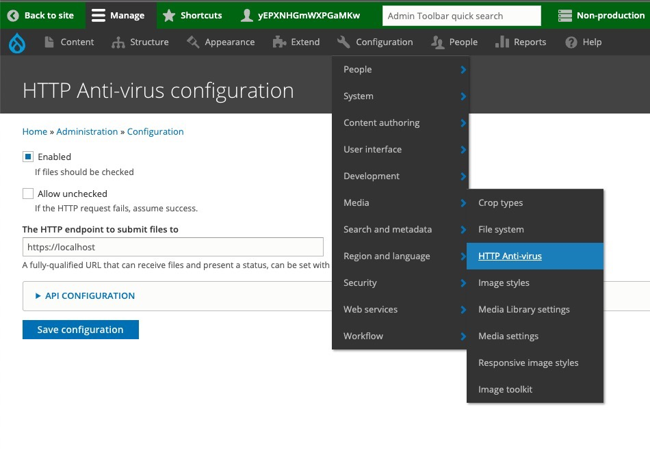

## Issue Found
```
Drupal Core: 8.7.8
Lightning: 4.0.5
PHP: 7.2

Steps to reproduce.
- Enable ClamAV and leave "host" field blank.
- Go to Content > Add Media > Image.
- Upload an image.
- An error should be returned reading: "The anti-virus scanner could not check the file, so the file cannot be uploaded. Contact the site administrator if this problem persists." This is the expected result since we did not configure the clamav host.
```


## Resolution Approah

Go to "/admin/config/httpav" and:
- (either) toggle "`llow unchecked (If the HTTP request fails, assume success.)`" on
- (or) toggle "`Enabled (If files should be checked)`" off



