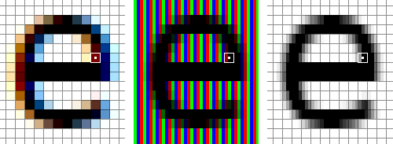
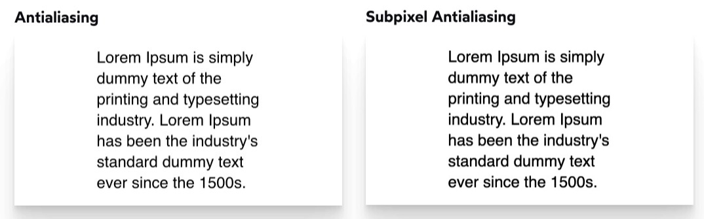

---

### What is anti-aliasing


**Anti-aliasing** is quite straight forward, it is a technique used in computer graphics to **smooth out the appearance of edges** in images or text. It works by adding **semi-transparent pixels** along the edges to simulate a smoother transition between the foreground and background colors. This process helps reduce jagged or pixelated edges, resulting in a more visually appealing and polished look.


Note that **one such semi-transparent pixel** is made up by **three sub pixels**: one red, one blue, one green, they work together to produce a color that forms the pixel. Consequently, while visually appearing as multiple pixels, in essence, it remains the same pixel as the original screen resolution.


---

### What is subpixel anti-aliasing

Subpixel anti-aliasing is a technique used in font rendering to **enhance the clarity and smoothness** of text on screens by taking advantage of the **RGB subpixels within each pixel**. By adjusting the intensity of these subpixels individually, subpixel anti-aliasing can render text with improved sharpness and detail, especially at smaller font sizes, resulting in crisper and more legible typography on displays.



Not that here the subpixels are **pixels on the edge of the letters/shape**, depending on the position of the letter and the screen subpixel arrangement, the color of this pixel may vary from blue/green/red. By using subpixel anti-aliasing, you are **getting 3x the physical resolution** as the original monitor, because 1 pixel have 3 sub-pixels.


However, depending on the different screen subpixel arrangement, the same subpixel anti-aliasing technique might look different, this is why company have developed software such as "ClearType by Microsoft"  providing users options of different subpixel anti-aliasing techniques to cater with different monitor.


---

### How does this matter to us "Web Developer" ?

According to Josh Comeau's [article](https://www.joshwcomeau.com/css/custom-css-reset/#one-box-sizing-model-2):

>   In MacOS Mojave, released in 2018, **Apple disabled subpixel antialiasing across the operating system**. I'm guessing they realized that it was doing more harm than good on modern hardware.
>
>   Confusingly, MacOS browsers like Chrome and Safari still use subpixel antialiasing by default.
>
>   ...
>
>   MacOS is the only operating system to use subpixel-antialiasing.




As a result of this, if you develop your website around a mac device (of which by default use `subpixel antialiasd` text in the browser), it will look diffeerent around other devices such as linux and windows (of which by default use `antialiased` text in the browser), visually text will be thinner on those devices.


To cope with this, we can use a CSS reset as proposed in his article:

```
body {
  -webkit-font-smoothing: antialiased;
}
```


### Reference
- https://www.youtube.com/watch?v=kANcyK1KFt8
- https://www.joshwcomeau.com/css/custom-css-reset/#one-box-sizing-model-2

