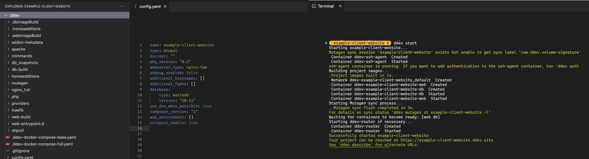
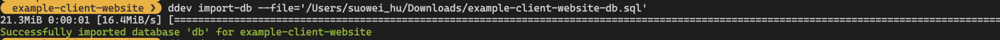
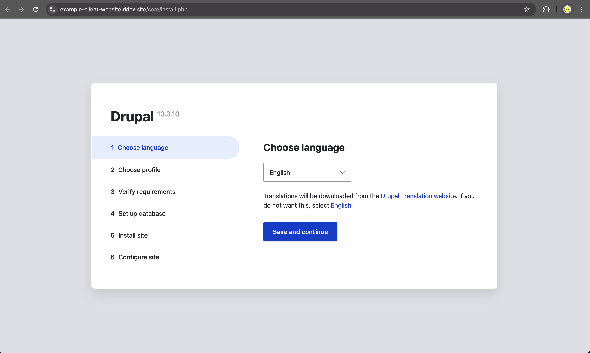

## TLDR Code Snippet

```
> cd $your_project_path
> ddev config --project-type drupal
> ddev start
> ddev composer install 
> ddev composer require drush/drush
> ddev drush cr 
> ddev launch 
> ddev drush user-login
> ddev launch $(ddev drush uli)
> ddev import-db --file="$your_db_file_path"
```


## Step-by-step breakdown 

(complete steps screenshot can be found at: [here](2.png))

#### Step-1: configuration initialisation and start environment

To begin with, you will need to get a copy of the project's filebase to your local computer, navigate to the project's folder, and initialize the ddev configuration file there using the `ddev config --project-type drupal` command: 

```
> cd /Download 
> ddev config --project-type drupal
```

**\*Optionally,** you may also enter argument, such as project's name and php's verison, at the time of writting this post, by default, the project's name fill be the folder's name, and php version will be `php 8.3.0` (You may find a full list of the argument at: [here](https://ddev.readthedocs.io/en/stable/users/usage/commands/#config)): 

```
> ddev config --project-type=drupal --project-name="my-website" --php-version=7.4
```

Once, the command finishes running, there'll be a new `\.ddev` directory created on the root of your project folder, and you will be able to start the project via running `ddev start`, of which will start the docker container: 



#### Step-2: install dependencies (inc. drush/drush) 

Next we'll use the `ddev composer` command to install the required dependencies for ddev: 

```
> ddev composer install
> ddev composer require 'drush/drush'
> ddev composer require 'drupal/paragraphs'
> ddev composer require 'drupal/admin_toolbar'
> ddev composer require 'drupal/field_group'
> ddev composer require 'drupal/twig_tweak'
> ddev composer require 'drupal/bootstrap_barrio:^5.5'
```

And you can even enable them using the `ddev drush` command once drush gets installed: 

```
> ddev drush en paragraphs 
> ddev drush en admin_toolbar
> ddev drush en admin_toolbar_search
> ddev drush en media
> ddev drush en media_library
> ddev drush en field_group
> ddev drush en twig_tweak
> ddev drush then bootstrap_barrio
```

#### Step-3: import database and login as admin

Lastly, to recover the project/website's content, you also need to get a copy of the project's database, and import it via the `ddev import-db` command: 

```
> ddev import-db --file='/Users/xxx/Downloads/example-client-website-db.sql'
> ddev drush cr
```



And lastly launch the project running via ddev via your browser, and login using the root user: 

```
> ddev launch
> ddev drush user-login
> ddev launch $(ddev drush uli)
```




## Reference

- [Drupal.org - Install Drupal using DDEV](https://www.drupal.org/docs/getting-started/installing-drupal/install-drupal-using-ddev)
- [DDEV.readthedocs.io - CMS Quickstart: Drupal](https://ddev.readthedocs.io/en/stable/users/quickstart/#drupal)
- [DigitalOcean - How To Develop a Drupal 9 Website on Your Local Machine Using Docker and DDEV](https://www.digitalocean.com/community/tutorials/how-to-develop-a-drupal-9-website-on-your-local-machine-using-docker-and-ddev?t)
