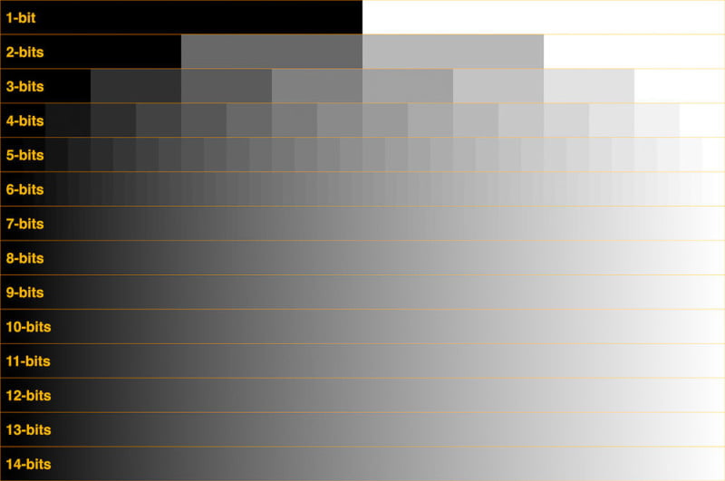
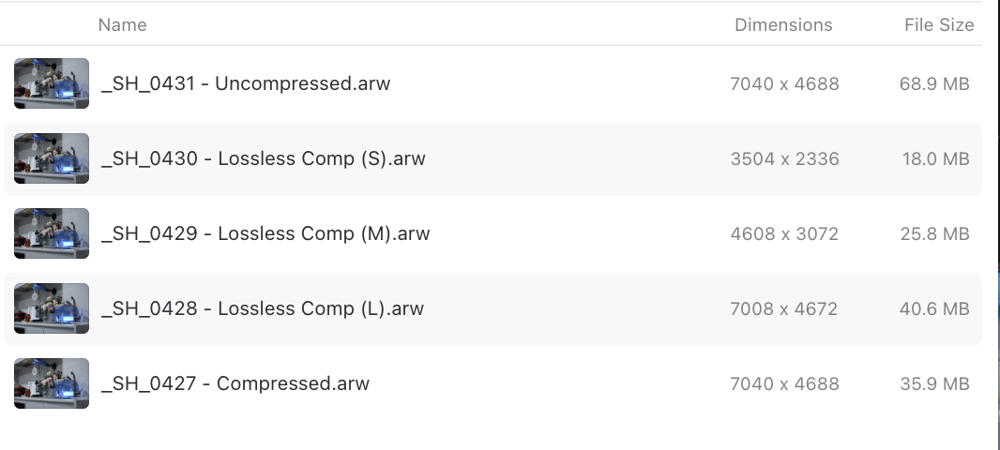
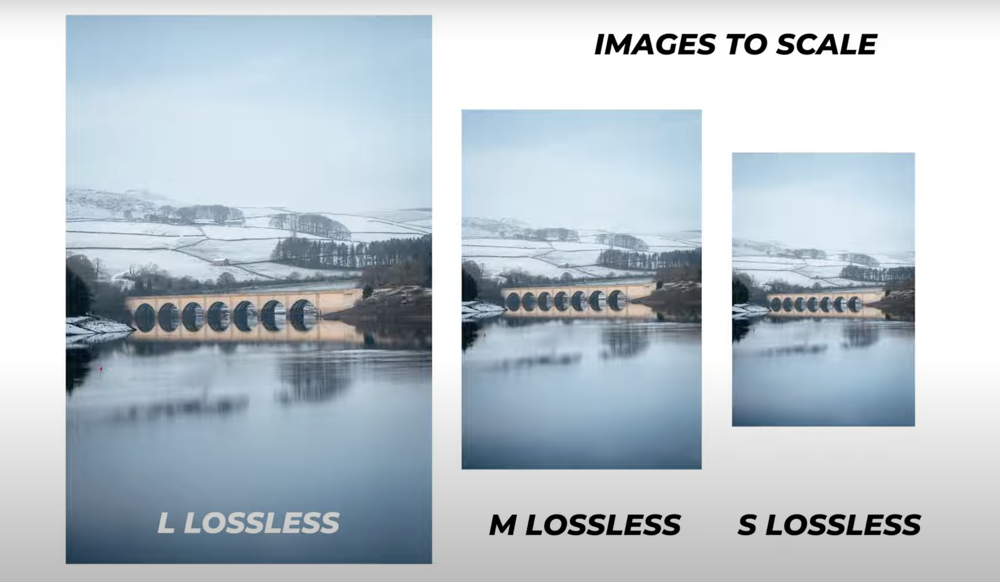
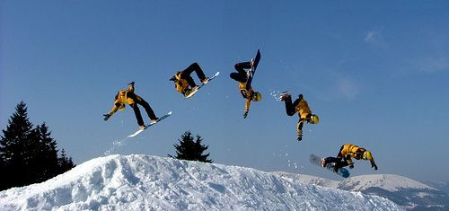

## Intuition

During a recent trip to Sydney, I found myself in a condition where there's only a single SD card with me, and I've forgotten my laptop at home for data export. So... I had to make sure I take every single shot carefully and not to use burst short to bloat up the memory, but this seems challenging since I am mostly walking down the CBD avenue and doing stree photography, not to mention I was constantly worried about running out of memory, although I managed to capture all my photos without any issues. As a result, once I returned home, I immediately began searching online for the largest SD card available, so I won't have to be in the same dilemma agin. However, I was surprised to discover a dramatic difference in prices between V30 to V90 SD cards.

| Storage Size | V30 | V60 | V90  |
| - | - | - | - |
| 128GB | $49 | $109 | $269  |
| 256GB | $89 | $209 | $519  |
| 512GB | $269 | $399 | $949 |

While it's clear that a high-tier SD card with superior writing and reading speeds will allow the camera's cache to dump faster, as a photographer, I don't mind waiting a bit longer beside my camera. After all, I'm not shooting anything in 4K at 120fps with 10-bit depth, which would require continuous data writing.

At least that's how I thought .... it turns out my A7M4 only allows different image format for different SD card you have inserted, when you have "sort/simultaneous recording" option turned on: 

| Storage                 | V30  | V60  | V90  |
| ----------------------- | ---- | ---- | ---- |
| JPEG                    | √    | √    | √    |
| Lossless Compressed (S) | √    | √    | √    |
| Lossless Compressed (M) | √    | √    | √    |
| Lossless Compressed (L) |      | √    | √    |
| Compressed Raw          |      | √    | √    |
| Uncompressed Raw        |      |      | √    |

As a result I figure I will need to understand what format I need before burning all my money into buying the fourfold expensive V90 card, hence this post differentiating the image format.

## Image Format Comparison

### Color Bits 

Most image formats use a color depth of **14 bits per color**, which provides 16,384 different values. However, the "Compressed Raw" format **reduces the color depth to 12 bits** during continuous shooting mode. 

### Ouput Resolution

The "Uncompressed Raw", "Lossless Raw (L)", and "Compressed Raw" formats do not alter the resolution of the image; they output the same number of megapixels that the camera physically captures. In contrast, the "Lossless Raw (M)" and "Lossless Raw (S)" formats **compress the image resolution by factors of 2x and 4x**, respectively.

### Frame Shot Per Second

The image format "Compressed Raw" format provides **higher frame per shot second (≈ 10 fps)** than the other formats which is sometimes worth it while shooting fast moving object in continuous shooting or burst mode. 

### Comparison DataSheet

| Image Format     | No Compression    in Color Bits ? | No Compress    in Resolution ? | Continuous Shoot Mode Burst Speed | Raw Sensor    Resolution (A7M4) | Output Image   Resolution (A7M4) | Color Bit & File Size    in Single Shoot Mode | Color Bit & File Size   in Continous Shoot Mode | File Size   (A7M4) |
| ---------------- | --------------------------------- | ------------------------------ | --------------------------------- | ------------------------------- | -------------------------------- | --------------------------------------------- | ----------------------------------------------- | ------------------ |
| Uncompressed Raw | Yes                               | Yes                            | ≤ 6       shot / second           | 7,008 x 4,672 = 32.7 MP         | 7,008 x 4,672 = 32.7 MP          | 14 bits                                       | 14 bits                                         | ≈ 65-70 MB         |
| Lossless Raw (L) | Yes                               | Yes                            | ≈ 6 ~ 7 shot / second             | 7,008 x 4,672 = 32.7 MP         | 7,008 x 4,672 = 32.7 MP          | 14 bits                                       | 14 bits                                         | ≈ 40-45 MB         |
| Compressed Raw   | No (12bit in Continuous)          | Yes                            | ≈10      shot / second            | 7,008 x 4,672 = 32.7 MP         | 7,008 x 4,672 = 32.7 MP          | 14 bits                                       | 12 bits                                         | ≈ 35-40 MB         |
| Lossless Raw (M) | Yes                               | No (14.2 MP)                   | ≈ 6 ~ 7 shot / second             | 7,008 x 4,672 = 32.7 MP         | 4,608 x 3,072 =14.2 MP           | 14 bits                                       | 14 bits                                         | ≈ 20-22 MB         |
| Lossless Raw (S) | Yes                               | No (8.19 MP)                   | ≈ 6 ~ 7 shot / second             | 7,008 x 4,672 = 32.7 MP         | 3,504 x 2,336 = 8.19 MP          | 14 bits                                       | 14 bits                                         | ≈ 15 MB            |

You can also find this data sheet at: [image-format-a7m4.csv](image-format-a7m4.csv)

## Reference 

-   https://www.youtube.com/watch?v=Fi6FVqkEuRU
-   https://www.youtube.com/watch?v=Xn5tRZ07zGs&t=168s
-   https://support.d-imaging.sony.co.jp/www/disoft/int/idc/intro/raw.html
-   https://au.pinterest.com/pin/single-vs-continuous-camera-drive-modes-explained--224476362650982015/ (imagery)