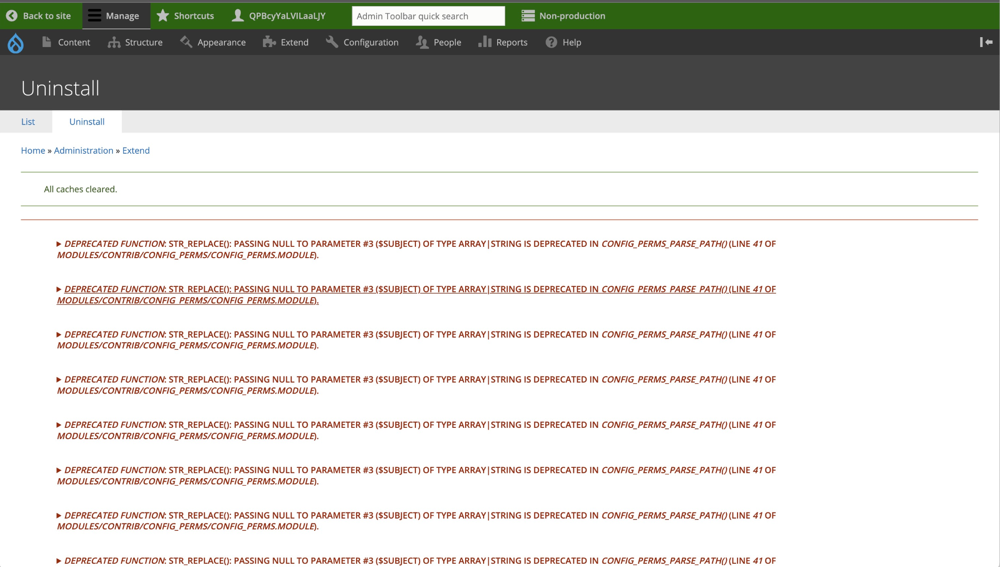

## Error Reproduced 

This eror happen amongst many of the SaaS GovCMS websites, where after the after installing the site locally, imported the production database, and login as administrator  using `pygmy` & `ahoy`, the first thing you see is: 

```
DEPRECATED FUNCTION: STR_REPLACE: PASSING NULL TO PARAMETER #3 ($SUBJECT) OF TYPE ARRAY | STRING IS DEPRECATED IN CONFIG_PERMS_PARSE_ PATHO (LINE 41 OF MODULES/CONTRIB/CONFIG_PERMS/CONFIG_PERMS.MODULE).
(* the same message got printed for multiple times
```

Also refer to the following screenshot: 




## Cause of the Error 

The error message you encountered, `DEPRECATED FUNCTION: STR_REPLACE: PASSING NULL TO PARAMETER #3 ($SUBJECT) OF TYPE ARRAY | STRING IS DEPRECATED`, is related to a change in PHP 8.1. This change deprecates passing `null` to certain parameters of built-in functions, including the third parameter (`$subject`) of the `str_replace()` function. Here’s a breakdown of the issue:

1.   **PHP 8.1 Deprecation**: In PHP 8.1, passing `null` to parameters that expect a non-nullable type (like `array|string`) is deprecated. Previously, such cases were silently converted to an empty string or handled without error.
2.   **Code Issue**: The error occurs because the `$subject` parameter being passed to `str_replace()` is `null`. This often happens due to:
     -   A variable not being initialized properly.
     -   A function (like `preg_replace()`) returning `null` due to an error or invalid input, which is then passed to `str_replace()`.


## Resolving the Error 

To fix this issue, you need to ensure that the `$subject` parameter passed to `str_replace()` is never `null`. For my instance, I simply need to add a null check before calling `str_replace()`, and provide a default value (like an empty string) in case it is `nul`. 

For example: 

```php
/* ----------- BEFORE (LINE: 41) */
function config_perms_parse_path($route) {
  if (is_array($route)) {
    $string = implode("\n", $route);
    return $string;
  }
  else {
    $route = str_replace(["\r\n", "\n\r", "\n", "\r"], "\n", $route);
    $parts = explode("\n", $route);
```

```php
/* ----------- AFTER (LINE: 41) */
function config_perms_parse_path($route) {
  if (is_array($route)) {
    $string = implode("\n", $route);
    return $string;
  }
  else {
    $route = $route  ?? ''; /* <----- ADDING THIS !!!!!!!!!!!*/
    $route = str_replace(["\r\n", "\n\r", "\n", "\r"], "\n", $route);
    $parts = explode("\n", $route);
```

In your specific case, the error maybe coming from somewhere else, and you'll need to read the error message carefully (and debug upstream function potentially) to find out exactly where it comes from.


### (Not Recommended) Quickly Surpressing the Error

Alternatively, you can also quickly surpress the error by uninstalling the module that holds this erronous code, for the above example, the error message is: 

```
DEPRECATED FUNCTION: STR_REPLACE: PASSING NULL TO PARAMETER #3 ($SUBJECT) OF TYPE ARRAY | STRING IS DEPRECATED IN CONFIG_PERMS_PARSE_ PATHO (LINE 41 OF MODULES/CONTRIB/CONFIG_PERMS/CONFIG_PERMS.MODULE).
(* the same message got printed for multiple times
```

Hence we can derive it comes from the module `Custom Permissions (config_perms)`, and as a result you can surpress the issue by simply uninstalling this module; But if you do this, please keep in mind this change though-out your local development, and make sure you don't push this as a part of the configuration (config sync) to the git repository.