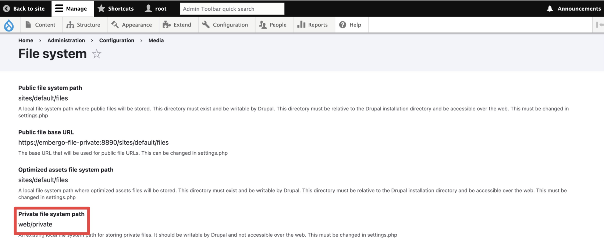
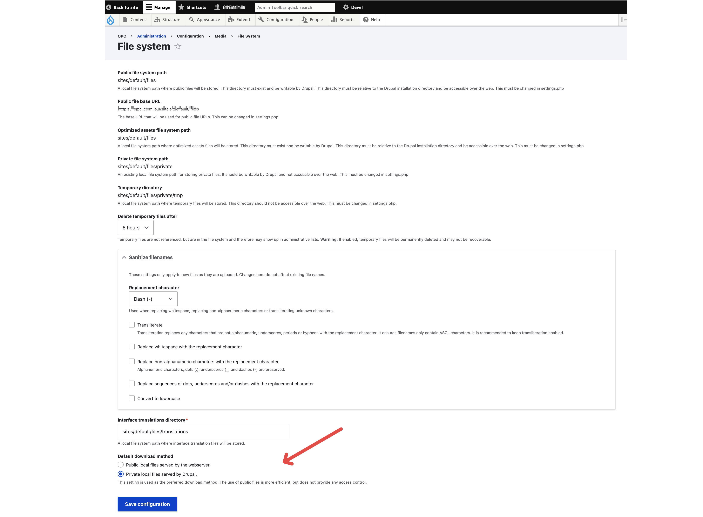
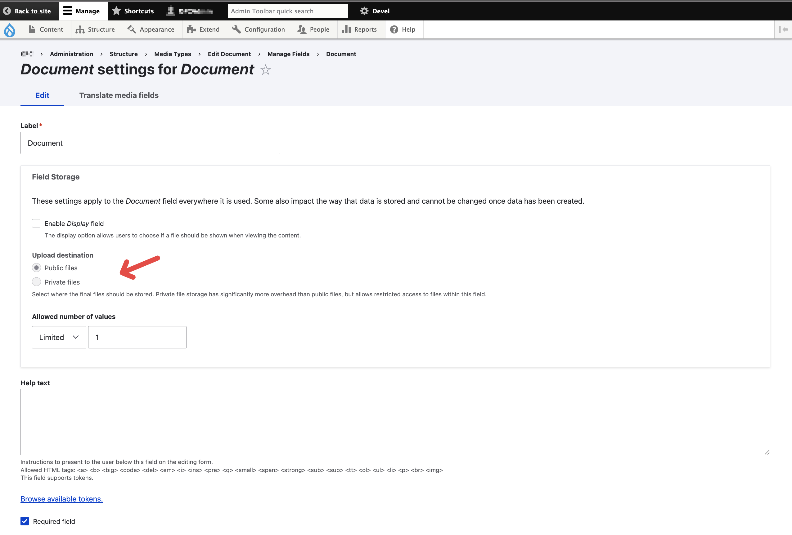

## Steps to Setup Private Upload Destination

### Step-1:  Activate Private File

To begin with you will need to configure private file directory, by defining `file_private_path` in `settings.php`: 

```
...
/**
 * Private file path:
 *
 * A local file system path where private files will be stored. This directory
 * must be absolute, outside of the Drupal installation directory and not
 * accessible over the web.
 *
 * Note: Caches need to be cleared when this value is changed to make the
 * private:// stream wrapper available to the system.
 *
 * See https://www.drupal.org/documentation/modules/file for more information
 * about securing private files.
 */
$settings['file_private_path'] = 'web/private';
...
```

It is recommended to keep the "<u>private files</u>" outside the "<u>public file folder</u>"; For instance, if the public file folder is `<root>/public_html/sites/default/files`, then you may put it somewhere else outside this directory, for instance `<root>/public_html/web/private`. 



(Also as a side note, to my understanding the permission on whether the visitor can access files within the private folder are controlled by drupal, instead of the default file permission, hence it is not requried remove the read permission from file, having `chmod 755 private_file_path` is okay)

### Step-2: Change File System Settings

Proceed to `<base_url>/admin/config/media/file-system`, we need to configure "default download method" setting; By default, you should see it being chosen as "**Public local files served by the webserver**", this means: if visitors want to download a file, or want to look at an image for example, it will invoke the file directly from the server/file-browser. 

In order for the drupal system to take over this control,  we'll need to change this setting to "**Private local files served by Drupal**" (This post: [link](https://bryanmanalo.com/drupal-private-file-mystery-who-has-access), explains the the mechnism behind the drupal system's permission control, over the files within the private upload destination, involving the `hook_file_upload`, `file_file_download` function in `file.module` file, `checkAccess` function in `FileAccessControlHandler.php`.)



### Step-3: Change Medias' Field Setting

Lastly, you'll need to configure the "upload destination"of relevant fields (image or files) in Media Types (or Content Types, if you are using images or files directly in them), changing them from the default "**public files**" to "**private files**":



(if you see this being gray-ed out, then it is likely that this media type have already got its associated items created; In order to make this field configurable again, you will need to delete all the items first, then return to the same configuration page)

According to this post: [link](https://www.drupal.org/forum/support/post-installation/2022-03-30/controlling-access-to-private-files), if you are an anonymous user and can't view the content because it is unpublished, you won't have access to the private files attached to it. If you are an anonymous user but can view the content because it is published, you will also be able to see the private file.

### Final Outcome Showcase

\[[basic-example-0.mp4](basic-example-0.mp4)\]


---

## Combining with "Sceduled Transition" Module 

You can "publish/unpublish" embargoed file (document/image) using scheduled rtasnition module + private file upload desitnation: 

\[[scheduled-transition-example-1.mp4](scheduled-transition-example-1.mp4)\]

You can also "replace" embargoed file (document/image) using the same setup: 

\[[scheduled-transition-example-2.mp4](scheduled-transition-example-2.mp4)\]

---

## Reference 

-   Controlling access to private files:

    https://www.drupal.org/forum/support/post-installation/2022-03-30/controlling-access-to-private-files

-   Mechnism behind the permission control of the private file uplaod desitnation: 

    https://bryanmanalo.com/drupal-private-file-mystery-who-has-access

-   Set private file as default upload destination: 

    https://www.lucius.digital/en/blog/always-secure-files-your-website-properly-why-and-how-do-it-drupal

-   Scheduled transition module how-to: 

    https://www.previousnext.com.au/blog/scheduled-transitions

---

*(\*also here's some alias of term mentioned:*

-   *public vs private file upload path, public vs private file upload destination*
-   *embargoed file, sensitive file, embargoed document, sensitive document*
