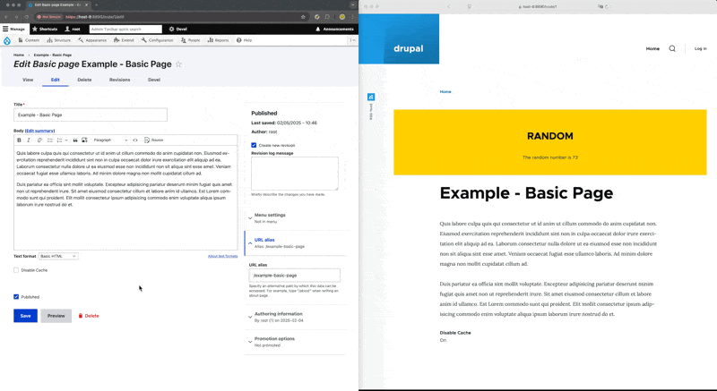

## Intuition 

I was working with a GovCMS SaaS environment where I have no control over the core code or modules, in another word, the only thing I can play around with is the custome theme. And the client requested for an cache invalidation mechnism, that they want remove the cachability feature from a portion of the website, as the follows: 

-   **Content Type**: for instance content type of machine name `article_noCache`, will not retain cache 
-   **Node ID / Url**: certain node of ID (e.g. `node=1`),  or certain url  (e.g. `http://<root-url>/example-standarg-page` , will not retain cache 
-   **Field Value**: disable cache for node if they have certain field equaling to a pre-defined value (e.g. boolean field `field_toggle_cacheDisable == 1`, so they can turn on/off cache for pages on the admin backend)


## Disclaimer (& Confession)

During the time writting this post, I **do not actually fully understand** how the caching in drupal works, all I understand is there's a drupal-side caching for render-array, and caching on the browser-side; And setting `http-header` to disable cache (i.e. `Cache-Control: max-age=0, no-cache, must-revalidate`) only disbale the browser-side caching; The drupal-side render-array-cache expiry is controlled by: cache tags, cache context. If a browser keep any of the two caching mentioned, it may potentially hold a historical/outdated version of the page. 

Of course I'll revisit this "Drupal Cache" topic when I get the chance to, but for now I am only sharing my pre-mature limited thoughts, and solution of what worked for me. If you are into this topic, please kindly refer to the reference section of the post for more materials. 


## Development Step Reproduced 

#### Step-0: Simulate Cached-Page Situation 

First of all, since updating a node will trigger the cache invalidation via the cache tag: 

>   Tagged cache items are invalidated via their tags, using [cache_tags.invalidator:invalidateTags()](https://api.drupal.org/api/drupal/core!lib!Drupal!Core!Cache!CacheTagsInvalidator.php/function/CacheTagsInvalidator%3A%3AinvalidateTags/8) (or, when you cannot inject the `cache_tags.invalidator` service: [`Cache::invalidateTags()`](https://api.drupal.org/api/drupal/core!lib!Drupal!Core!Cache!Cache.php/function/Cache%3A%3AinvalidateTags/8)), which accepts a set of cache tags (`string[]`).
>
>   -- Read more: https://www.drupal.org/docs/drupal-apis/cache-api/cache-tags

Let's simulate the  cached-page situation by overriding `page.html` to add a random number section: 

```
<html>
       ...
         ...
            
              <main role="main">
                <!-- ████████████████████████████████████████████████████████████████████████████████████████████████████████████████████████████████████████████████ -->
                <!-- Since this item does not have cache-tags/context set, it will be cached indefnitely until the invalidation of the page, or website cache rebuild -->
                <div 
                    style="border: 3px solid #ffcf00; background-color: #ffcf00; padding: 30px; margin-bottom: 10px; text-align: center; margin-bottom: 30px">
                    <h2> RANDOM </h2>
                    <p> The random number is {{ random(0, 100) }} </p>
                </div>
                <!-- ████████████████████████████████████████████████████████████████████████████████████████████████████████████████████████████████████████████████ -->
                {{ page.content_above }}
                {{ page.content }}
              </main>
            
            {{ page.content_below }}
        ...
    ...
</html>
```

of which has no cache-tag and cache-context, hence will be cached indefnitely. 


#### Step-1: Custom Theme Hook

Since we only have the ability to play with custom theme, that means we can only play around with the theme hooks to manipulate the render hook, here for showcasing purpose let's use theme hook `theme_page_attachments_alter`, simply chuck the below code in your `customThemeName.theme` file; For our instance we are using the `olivero` theme, we need to add the following into `olivero.theme`: 

```php
function olivero_page_attachments_alter(&$attachments){
    disable_renderCacheFor_nodeOfID(1, $attachments);                             // Disable Cache for node with ID 1
    disable_renderCacheFor_url('/example-basic-page', $attachments);              // Disable Cache for url of "<root-url>/node/1"
    disable_renderCacheFor_contenType('page', $attachments);                      // Disable Cache for all page of content type page (Standard Page)
    disable_renderCacheFor_fieldEquals('field_disable_cache', '1', $attachments); // Disable Cache for all node with field_disable_cache = 1
}
```

#### Step-2: Conditional to Determine when to Invalidate 

Next we'll define the functions used above that determines when to invalidate the scache for pages (also in `oliver.theme`): 

```php
function disable_renderCacheFor_nodeOfID($nodeId, &$attachments){
    // Get current node
    $node = \Drupal::routeMatch()->getParameter('node');
    // Target specific node ID
    if ($node && $node instanceof \Drupal\node\NodeInterface && $node->id() == $nodeId) {
        disable_browserCache_attachments($attachments);
        disable_renderCacheFor_attachments($attachments);
    }
}
```

```php
function disable_renderCacheFor_url($url, &$attachments){
    // Get current path (and alias)
    $current_path  = \Drupal::service('path.current')->getPath();
    $internal_path = \Drupal::service('path_alias.manager')->getAliasByPath($current_path);
    // Disable cache for current path or its alias
    if ($current_path==$url || $internal_path == $url) {
        disable_browserCache_attachments($attachments);
        disable_renderCacheFor_attachments($attachments);
    }
}
```

```php
function disable_renderCacheFor_contenType($contenType, &$attachments){
    // Get current node
    $node = \Drupal::routeMatch()->getParameter('node');
    // Disable cache for current node if its content type matches the target
    if ($node && $node instanceof \Drupal\node\NodeInterface && $node->getType() === $contenType) {
        disable_browserCache_attachments($attachments);
        disable_renderCacheFor_attachments($attachments);
    }
}
```

```php
function disable_renderCacheFor_fieldEquals($fieldName, $fieldValue, &$attachments){
    // Get current node
    $node = \Drupal::routeMatch()->getParameter('node');
    // Disable cache for current node if its field matches the target
    if ($node && $node instanceof \Drupal\node\NodeInterface && $node->hasField($fieldName) && $node->get($fieldName)->value == $fieldValue) {
        disable_browserCache_attachments($attachments);
        disable_renderCacheFor_attachments($attachments);
    }
}
```

#### Step-3: Logic to Disable Cache 

Lastly, we need to implment the two logic function that disables the caching: `disable_browserCache_attachments` and `disable_renderCacheFor_attachments`  

```php
function disable_browserCache_attachments(&$attachments){
    // 1. Disable render cache
    $attachments['#cache']['max-age'] = 0;
    // 2. Set HTTP headers
    $attachments['#attached']['http_header'][] = ['Cache-Control','no-store, no-cache, must-revalidate, post-check=0, pre-check=0, max-age=0'];
    // 3. Add HTML meta tags for extra prevention
    $attachments['#attached']['html_head'][] = [['#tag' => 'meta','#attributes' => ['http-equiv' => 'Cache-Control','content' => 'no-cache, no-store, must-revalidate']],'cache_control'];
}
function disable_renderCacheFor_attachments(&$attachments){
    // *. This is the line of code that worked for me, and honestly I don't know why it works .... (I'll put more effort into understanding this when times comes)
    //    stop full page from being cached (according to some post, caching of the page are not controlled by the max-age)
    \Drupal::service('page_cache_kill_switch')->trigger();
}
```

(Another disclaimer here: though I understand and wrote the `disable_browserCache_attachments` to disable the browser-side cache, I do NOT know/understand how to invalidate drupal-side render-arry-cache, `\Drupal::service('page_cache_kill_switch')->trigger();` is just a solution I happen to run into when randomly browsing online, I need to dig deeper into this when I got the time). 

#### Combined Code Snippet

```
function disable_browserCache_attachments(&$attachments){
    // 1. Disable render cache
    $attachments['#cache']['max-age'] = 0;
    // 2. Set HTTP headers
    $attachments['#attached']['http_header'][] = ['Cache-Control','no-store, no-cache, must-revalidate, post-check=0, pre-check=0, max-age=0'];
    // 3. Add HTML meta tags for extra prevention
    $attachments['#attached']['html_head'][] = [['#tag' => 'meta','#attributes' => ['http-equiv' => 'Cache-Control','content' => 'no-cache, no-store, must-revalidate']],'cache_control'];
}
function disable_renderCacheFor_attachments(&$attachments){
    // *. This is the line of code that worked for me, and honestly I don't know why it works .... (I'll put more effort into understanding this when times comes)
    //    stop full page from being cached (according to some post, caching of the page are not controlled by the max-age)
    \Drupal::service('page_cache_kill_switch')->trigger();
}
function disable_renderCacheFor_nodeOfID($nodeId, &$attachments){
    // Get current node
    $node = \Drupal::routeMatch()->getParameter('node');
    // Target specific node ID
    if ($node && $node instanceof \Drupal\node\NodeInterface && $node->id() == $nodeId) {
        disable_browserCache_attachments($attachments);
        disable_renderCacheFor_attachments($attachments);
    }
}
function disable_renderCacheFor_url($url, &$attachments){
    // Get current path (and alias)
    $current_path  = \Drupal::service('path.current')->getPath();
    $internal_path = \Drupal::service('path_alias.manager')->getAliasByPath($current_path);
    // Disable cache for current path or its alias
    if ($current_path==$url || $internal_path == $url) {
        disable_browserCache_attachments($attachments);
        disable_renderCacheFor_attachments($attachments);
    }
}
function disable_renderCacheFor_contenType($contenType, &$attachments){
    // Get current node
    $node = \Drupal::routeMatch()->getParameter('node');
    // Disable cache for current node if its content type matches the target
    if ($node && $node instanceof \Drupal\node\NodeInterface && $node->getType() === $contenType) {
        disable_browserCache_attachments($attachments);
        disable_renderCacheFor_attachments($attachments);
    }
}
function disable_renderCacheFor_fieldEquals($fieldName, $fieldValue, &$attachments){
    // Get current node
    $node = \Drupal::routeMatch()->getParameter('node');
    // Disable cache for current node if its field matches the target
    if ($node && $node instanceof \Drupal\node\NodeInterface && $node->hasField($fieldName) && $node->get($fieldName)->value == $fieldValue) {
        disable_browserCache_attachments($attachments);
        disable_renderCacheFor_attachments($attachments);
    }
}
function olivero_page_attachments_alter(&$attachments){
    // disable_renderCacheFor_nodeOfID(1, $attachments);                             // Disable Cache for node with ID 1
    // disable_renderCacheFor_url('/example-basic-page', $attachments);              // Disable Cache for url of "<root-url>/node/1"
    // disable_renderCacheFor_contenType('page', $attachments);                      // Disable Cache for all page of content type page (Standard Page)
    // disable_renderCacheFor_fieldEquals('field_disable_cache', '1', $attachments); // Disable Cache for all node with field_disable_cache = 1
}
```


## Final Outcome Showcase 

To showcase the final outcome, let's take the `disable cache for node if they have certain field equaling to a pre-defined value` via `disable_renderCacheFor_fieldEquals` as an example. First you will need to create and add the field to the content type like the following: 


Then with the snippet `disable_renderCacheFor_fieldEquals('field_disable_cache', '1', $attachments)` in the theme hook `olivero_page_attachments_alter` (as previously demonstrated), you should be able to control the caching of the page via toggling on/off this "Disable Cache": 




## Reference

**Drupal.org**

- [Drupal.org: cache max-age (time dependencies)](https://www.drupal.org/docs/drupal-apis/cache-api/cache-max-age)
- [Drupal.org: cacheability of render array](https://www.drupal.org/docs/drupal-apis/render-api/cacheability-of-render-arrays)
- [Drupal.org: cache tags (data dependency)](https://www.drupal.org/docs/drupal-apis/cache-api/cache-tags)
- [Drupal.org: cache contexts ((request) context dependencies)](https://www.drupal.org/docs/drupal-apis/cache-api/cache-contexts)
- [Drupal.org: cache overview (authenticated user VS visitors)](https://www.drupal.org/docs/7/managing-site-performance-and-scalability/caching-to-improve-performance/caching-overview)

**Other Resources**

- [Drupal Answers: How can I stop full page HTML from being cached? ](https://drupal.stackexchange.com/questions/219568/how-can-i-stop-full-page-html-from-being-cached)
- [YouTube: example custom module (potato\_cache)](https://www.youtube.com/watch?v=xk3mSGmB7Xg)
- [https://www.drupal.org/docs/administering-a-drupal-site/internal-page-cache](https://www.drupal.org/docs/administering-a-drupal-site/internal-page-cache)
- [https://api.drupal.org/api/drupal/core%21core.services.yml/service/page\_cache\_kill\_switch/10](https://api.drupal.org/api/drupal/core%21core.services.yml/service/page_cache_kill_switch/10)

**Example Files** 

-   \[[olivero.theme](olivero.theme)\]
-   \[[page.html.twig](page.html.twig)\]
