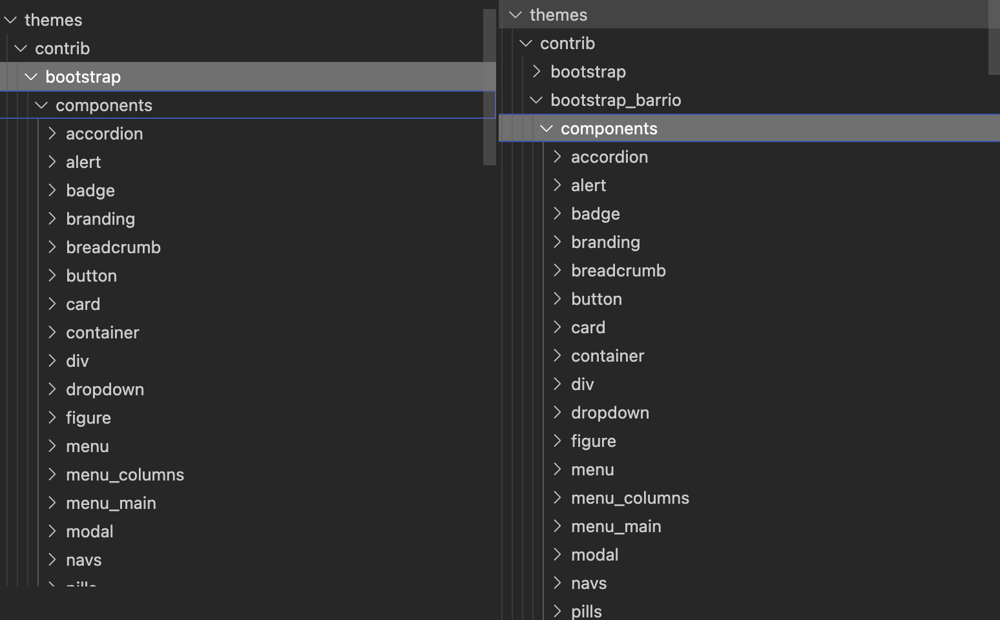
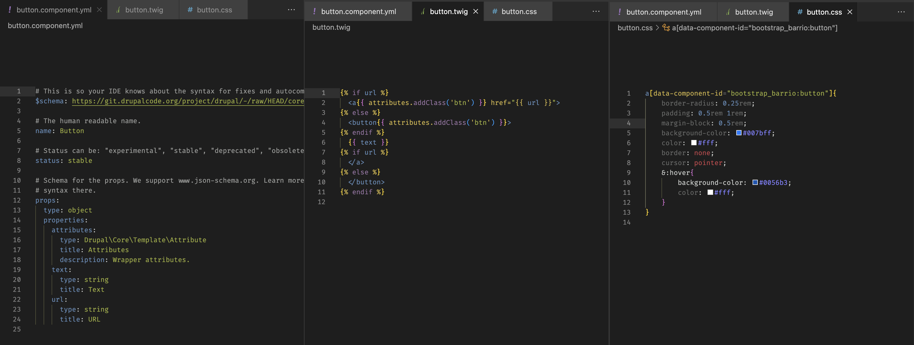
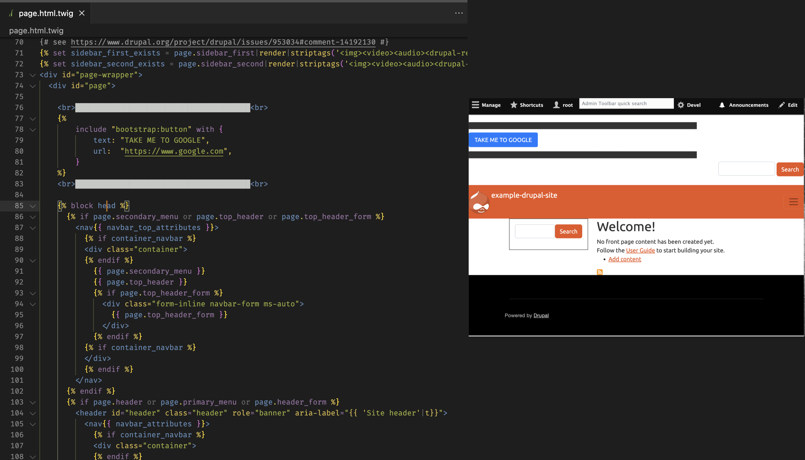
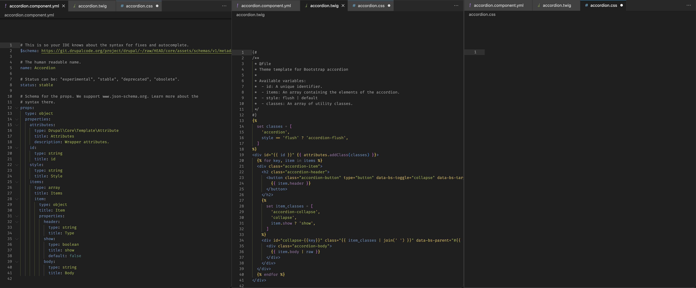
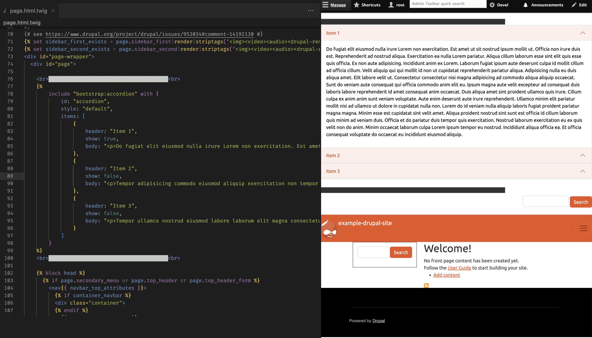
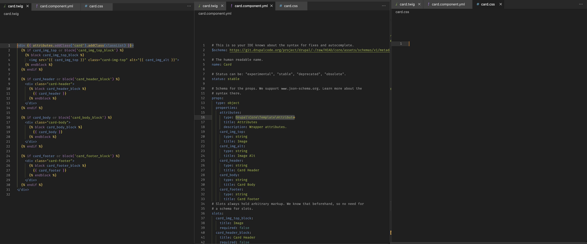
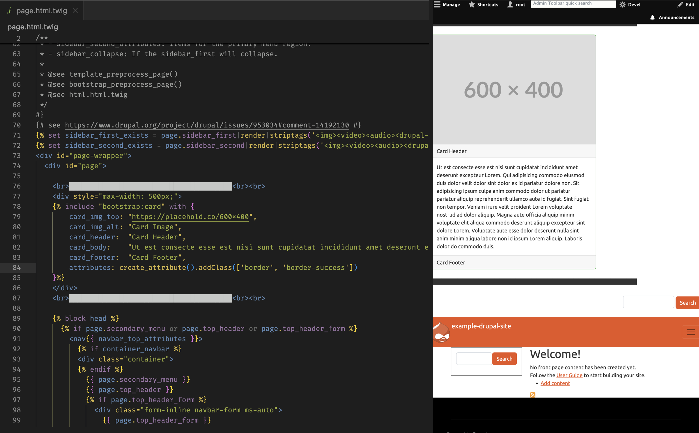
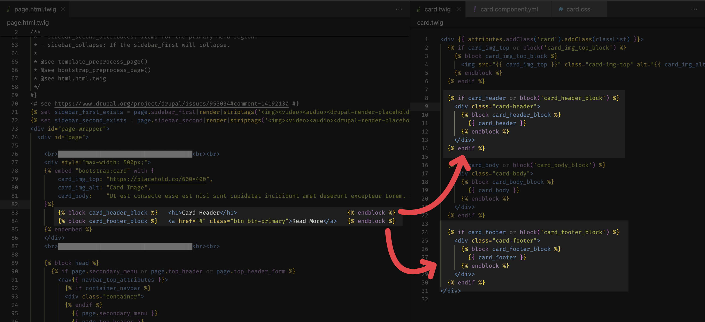
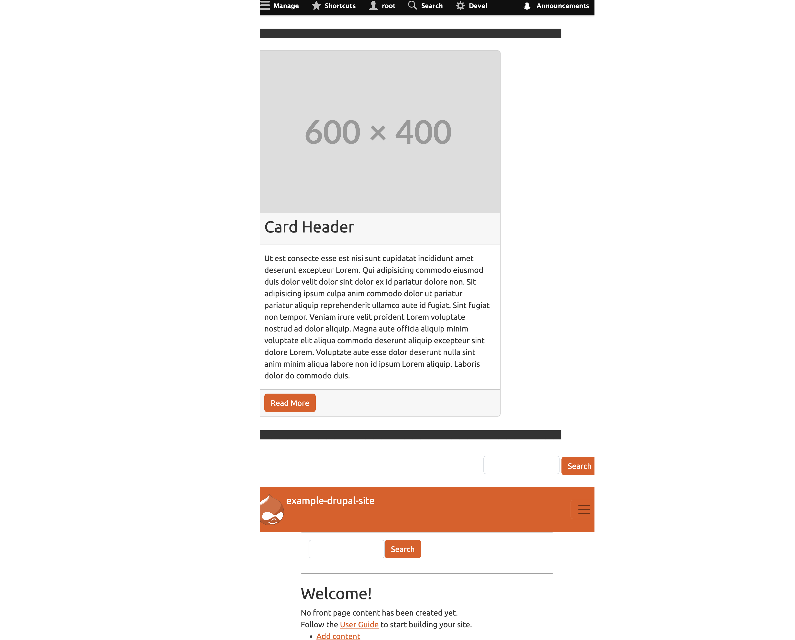

## Intuition

As I download some contributed theme from the Drupal.org, I found the majority of these contributed themes are holding a  `component` directory with in their theme root folder: 

Inside this `<theme-root>/component` folder seems to be dozens built-in of single-directory component (SDC) provided by theme, which makes me wonder if we are allowed to reuse these to our advantage. It turns out you can use the `` or `` keyword to re-use these component in any twig template, and I'll demonstrate how in this blog post.

(The specifics on how to create a SDC can be found here: [link-1](https://www.drupal.org/docs/develop/theming-drupal/using-single-directory-components/quickstart), [link-2](https://www.drupal.org/docs/develop/theming-drupal/using-single-directory-components/creating-a-single-directory-component). If you are interested in creating SDC of your own, you can refer to this link, another blog post of mine is also about this topic)

## Demonstration 

#### **Pre-requisit Drupal and Theme Setup**

Before proceeding, you will need to have: 

-   A working Drupal 10 installation 
-   Installed `bootstrap` ([Bootstrap5](https://www.drupal.org/project/bootstrap5)) and have set it as your default theme 
-   Also remeber to choose a "load libary" in the installed theme's setting (see: [screenshot](2025-02-10T133058.png) for instruction) if you don't the theme will be style-less.

#### Use component via  function

**Demo-1: include button**

To beign with, let's demonstrate a very simple case to re-purpose one of button component located at the `boostrap/component/alert` folder, by `` it in the `*.html.twig` template. Below are the files located in the alert component's folder, followed by its usage in the `page.html.twig` (note that the `button.css` is filled with some placehodler style for demo purpose): 

From the above example, we can see: the use of a compoennt in `*.html.twig` template using the twig's build-in `` function; There are two parameters you need to enter differently based on your specific need: 

-   `[theme-name]:[component]`: the component ID 
-   `{arguments1:value1, argument2:value2, ...`: the exact argument based on the defined structure in `<sdc-name>.component.yaml` file.

**Demo-2: include accordion** 

Another demonstration of the use for  `include` function, below are the three relevant files that made-up the accordion SDC in `bootstrap/components/accordion`, followed by its usecase in `page.html.twig`

**Demo3: include Card** 

Another example using `boostrap/components/card` as the component in `page.html.twig`, in this one I'll showcase how to pass in class-names using the `attribute` property in the schema (notice here I have modified line-1 of the `class.tiwg` file from  `
` to `
` for demo purpose): 

Notice in this example I used the `Drupal\Core\Template\Attribute` property in the schema, to add the `border` and `border-success` to the attribute of the component (and you can use it via `{{attributes}}` in the component's `twig` template.

#### Use component via  function

**Demo1: embed card (with button in footer block)**

By using embed funciton you can override twig blocks (aka slots), for instance let's override the previously showcased `bootstrap/component/card` component, to use `<h1>` as the wrapper of the `card_header_block`, and to include a button in the `card_footer_block` area of the card (note ethat these slots/blocks needs to be pre-defined in the SDC in both the `twig` and `yml` file): 

## Reference 

-   [Drupal.org - Using your new single-directory component](https://www.drupal.org/docs/develop/theming-drupal/using-single-directory-components/using-your-new-single-directory-component)

-   [Florida DrupalCamp - Building a component library with SDC](https://www.youtube.com/watch?v=CEjlQ4V_jbs&t=963s)
-   [Drupal.org - Themes - Bootstrap5](https://www.drupal.org/project/bootstrap5)
-   [Drupal.org - Themeing in Drupal - Using attributes in templates](https://www.drupal.org/docs/8/theming-drupal-8/using-attributes-in-templates)
