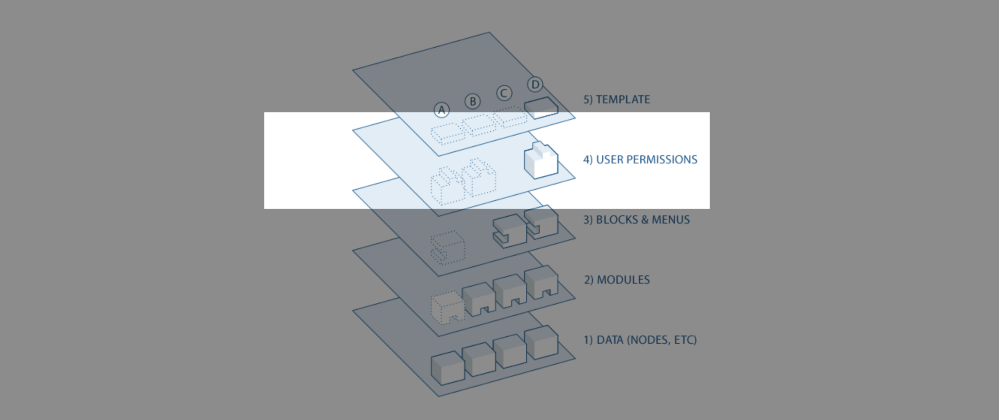

## Explaination from Drupal.org 

>   **Drupal Data Flow Layers** 
>
>   If you want to go deeper with Drupal, you should understand how information flows between the system's layers. There are five main layers to consider:
>
>   1.  At the base of the system is the collection of nodes, the data pool. Before anything can be displayed on the site, it must be input as data.
>   2.  The next layer up is where modules live. Modules are functional plugins that are either part of the Drupal core (they ship with Drupal) or are contributed items that have been created by members of the Drupal community. Modules build on Drupal's core functionality, allowing you to customize the data items (fields) on your node types; set up e-commerce; programmatically sort and display content (custom output controlled by filters you define); and more. There are thousands of different options within the fast-growing [repository of contributed Drupal modules](https://drupal.org/project/modules). They represent the innovation and collaborative effort of everyone from individuals to large corporations.
>   3.  At the next layer, we find blocks and menus. [**Blocks**](https://www.drupal.org/docs/8/core/modules/block/overview) often provide the output from a module or can be created to display whatever you want and then can be placed in various spots (Regions) in your template (theme) layout. Blocks can be configured to output in various ways, as well as only showing on certain defined pages, or only for certain defined users. [**Menus**](https://www.drupal.org/docs/8/core/modules/menu-ui/overview) are navigators in Drupal, which define the content coming in each defined menu path (relative URL). Menus are a core element of Drupal that provide links to all the pages created in Drupal.
>   4.  Next are user permissions. This is where settings are configured to determine what different kinds of users are allowed to do and see. Permissions are defined for various roles and in turn, users are assigned to these roles in order to grant them the defined permissions.
>   5.  On the top layer is the site theme (the "skin"). This is made up predominantly of HTML5 and CSS, with some Twig variables intermixed, so Drupal-generated content can go in the appropriate spots. Also included with each theme is a set of functions that can be used to override standard functions in the modules in order to provide complete control over how the modules generate their markup at output time. Templates can also be assigned on-the-fly based on user permissions.
>
>   This directional flow from bottom to top controls how Drupal works. Is some new functionality you want not showing up? Perhaps you uploaded the module into the system but have not activated it yet and this is making everything downstream non-functional (as in "A" in the diagram above).
>
>   Maybe the module is installed and activated, but you still don’t see what you want on your site. Did you forget to place the block, as in "B"? Or are your user permission settings conflicting with what you want, and your users are not set to see the output as in "C"?
>
>   Additionally, as mentioned earlier, getting the kind of granular control you want over the details of the HTML5 module outputs requires understanding this flow. Are you using a module that does exactly what you want, only you wish the markup was just a little bit different? Maybe you’d like it to use different tags, or you’d like to assign a CSS class to something? You accomplish this by copying the output function from the module and pushing it up to the functions document in your theme. Modify the code there and when the system goes to output, it will see your customized function and use that instead.
>
>   -- \[[Drupal.org - Drupal - Understanding Drupal - The Drupal flow](https://www.drupal.org/docs/getting-started/understanding-drupal/overview-of-drupal#s-the-drupal-flow)\]


---

## Interpertation and Breakdown

#### **1\) Data (Nodes, Block, Taxonomy, etc)**


**Data layer** is the first/base layer of the flow, it is usually the **database** of drupal, but in some scenarios it can also be a decoupled data source, for instance **headless Drupal till the data layer**, or even an **JSON/XML API**. 

For any node you can use the [devel module](https://www.drupal.org/project/devel) to find its raw node information before any processing happens (raw node values data) via the "**Devel Load**" or "Devel Load (with reference)" tab: 


In [Acquia's example](https://www.youtube.com/watch?v=JYEnjqoJ1nc&list=PLpVC00PAQQxGw-jupPsnJOmWgE3YE3-AK&t=151s), it is pictured as the meta data of a product stored in some way within the database; Though Drupal does not support MongoDB, for the example purpose, you can think it as a collection of the object made-up of json object alike the following: 

```
{ 
	model:    "DG4474",
	brand:    "Rayban",
	type:     "Sun Glass",
    color: {
		frame:       "#1F1F1F",
		glass:       "#844E29"
	},
	price:  {
		online:      "$972",
		store:       "$985",
		manufacture: "$100"
	},
	stock_info: {
		count:             "11",
		shelf:             ["1A", "3F", "0Z"]
		last_updated_unix: "1739226068"
	},
	... ,
	... ,
	... ,
	... ,
}
	
```

#### **2\) Modules (Contributed/Custom Module, Plug-in, Module Hooks, etc)**


**Module layer** is made up of functional **Plug-in (API)** , the plugins can either be built-in from core, or appended to the system via the contributed or custom module. These plug-ins provides functionalities in an exensible, object-oriented way, allowing modules to create re-usable swappable components that follows speific interfaces. Moreover, you can also add procedural function-based **Module Hooks**, of which extends drupal's functionality via secifcally-named functions, allowing the modules to alter behavior without modifying the exisintg code. 

Below is an example of a custom module that will multiply the online sell price (of the aformentioned product data object) by a factor of 0.7 when it is boxing day 

```yml
name:                     'Boxing Day Discount'
description:              'Applies a 30% discount to product prices on Boxing Day'
type:                      module
package:                   Custom
core_version_requirement:  ^9 || ^10
```

```php
<?php
use Drupal\Core\Entity\EntityInterface;
use Drupal\Core\Entity\Display\EntityViewDisplayInterface;
/* Implements hook_entity_view(). */
function boxing_day_discount_entity_view(array &$build, EntityInterface $entity, EntityViewDisplayInterface $display, $view_mode) {
  // Check if it's a product content type and has the price field
  if ($entity->getEntityTypeId() === 'node'
      && $entity->bundle() === 'product'
      && $entity->hasField('field_online_price_aud')) {

    // Check if today is Boxing Day (December 26)
    $today = new \DateTime('now', new \DateTimeZone('Australia/Sydney'));
    $is_boxing_day = ($today->format('m-d') === '12-26');

    if ($is_boxing_day && !empty($entity->field_online_price_aud->value)) {
      // Apply 30% discount (multiply by 0.7)
      $original_price = $entity->field_online_price_aud->value;
      $discounted_price = $original_price * 0.7;

      // Update the rendered price
      if (isset($build['field_online_price_aud'][0])) {
        $build['field_online_price_aud'][0]['#markup'] = number_format($discounted_price, 2);
      }

      // Add a notice about the Boxing Day discount
      $build['boxing_day_notice'] = [
        '#markup' => '<div class="boxing-day-discount-notice">Boxing Day 30% Discount Applied!</div>',
        '#weight' => -99,
      ];
    }
  }
}
```

(`boxing_day_discount.info.yml` and `boxing_day_discount.module`)

#### **3\) Blocks & Menus (Render Array)**


**Block & menu layer** is the where the **render array** lives:  Block often comes from the output of the modules, or the display output (before rendering using theme's twig); These display output (or view), can either server as a block to be placed in various regions in your theme layout (and conditionally hide then for certain Url or user), or be a stand-able page by itself. Menus are the navigation of the drupal, and is linked to all pages created.  


Like mentioned in data layer, you can also view the render array using the [devel module](https://www.drupal.org/project/devel), via the "**Render Tab**": 


#### **4\) User Permissions (Access Check)**



Determine if user is allowed to see... (skipped for now )

#### **5\) Theme & Template (Theme Hook, Twig, Libraries (CSS/JavaScript), etc)**


**Theme & Template Layer** , this is where the site turns the  render array (from block&menu layer) into final HTML+CSS+JS resources served to the browser. 

The theme can use the **Theme Hooks** override preprocessor the renderr array (for instance replace date in unix-format to timestamp-format), use twig template to turn raw values into well-formatted rich-style components in HTML; As well as the use of CSS to style the components further, add interactivity via JavaScript or Libraries such as Slick-Slider. 

Below is a brief demonstrative illustration for what could be happening in this layer: 

>   **Raw Render Array** 
>
>   
>
>   **Theme Manipulated Rendar Array** 
>
>   
>
>   **Twig Template Rendered HTML** 
>
>   
>
>   **Style HTML with CSS Sheet **
>
>   
>
>   **Interactivity using JavaScript (Slick Slider)**
>
>   


---

## Refernece 

-   [Drupal.org - Drupal - Understanding Drupal - The Drupal flow](https://www.drupal.org/docs/getting-started/understanding-drupal/overview-of-drupal#s-the-drupal-flow)

-   [YouTube: Acquia - How does Drupal Theming Work](https://youtu.be/JYEnjqoJ1nc?list=PLpVC00PAQQxGw-jupPsnJOmWgE3YE3-AK&t=151)

-   [Drupal.org - Drupal APIs - Render API - The Drupal 8 render pipeline](https://www.drupal.org/docs/drupal-apis/render-api/the-drupal-8-render-pipeline)

-   [Drupal.org - Drupal APIs - Render API - Request handling and rendering flow](d8_render_pipeline_1.png)

    

---

## Relevant Keywords  

-   Drupal Core Data Layers
-   Drupal Core Data Flow / Drupal Flow 
-   Drupal Core Process 
-   Drupal Render Pipeline 
-   Drupal Requst Handling and Render Flow 

