## TLDR;

Schema markup (schema.org) is a agreed structured data format that exposes the context and content of website to the search engine; One of the most common practice to add schema markup to websites is through `json-ld` data wrapped in `<script>` tag ;  With the addition of these structured markup data, the search engine will then be able to understand the website, and provide additional feature such as rich-style interactive component like card, carousel, accrodion, etc, making your website stand-out amongst the other search result in organic search.

---

## **What is Schema Markup (Schema.org) ?**

>    Schema.org was founded by Google, Microsoft, Yahoo, and Yandex with the mission to create, maintain, and promote sche structured data on the internet. In other words, it's a **common markup language that all search engines can understand and context**. By leveraging the Schema.org vocabulary, you can help increase the search engine's understanding of your website. Here are the main types used for Rich Features within Google SERPs: Articles, Breadcrumbs, FAQS, How-to, Local Business, Organization (Logo), Product (Service), Q&A, Reviews, Video, etc.
>
>   (how does it work?) Schema.org is set up in a **hierarchical order**. The broadest item type is "Thing." Each Item type has "properties" that further describe it. Some properties are required, while others just add more details and context. As you choose a property, be as precise as possible. Choose the correct item and then define all the properties associated with the "Thing" you defined.Schema.org has a page for each Item Type (for instance [Schema.org - FAQPage](https://schema.org/FAQPage)) where you'll find examples at the bottom of each page that can help you understand how to create the markup.
>
>   -- \[[SMA Marketing](https://www.youtube.com/watch?v=_HFRnsv7wFA)\]

Below are an few example of the different types of "schema.org"  structured data (LEFT: its schema definition, RIGHT, data that follows the schema):

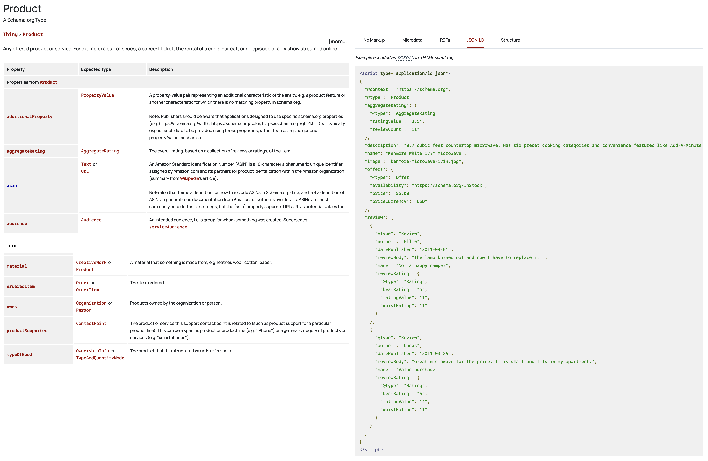

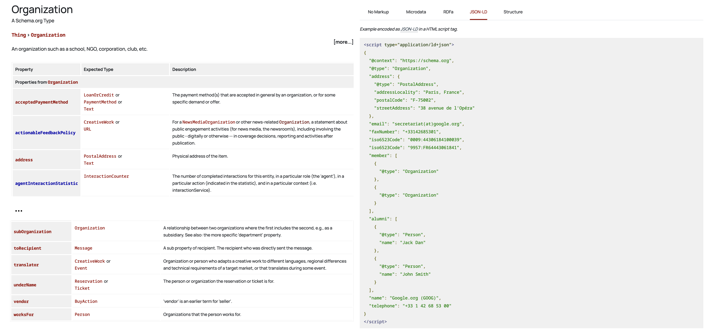

You can find a full list of such schema types on this page: https://schema.org/docs/full.html

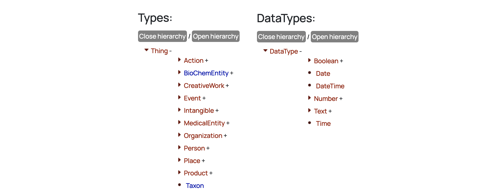

---

## Where to use/add Schema Markup (Schema.org) ?

>   There are three ways to communicate schema markup to search engine like Google. Essentially, these are coding methods your schema markup code is formatted in. So it is machine-readable. These include:
>
>   -   **JSON-LD**: is a JavaScript-based method for implementing schema markup.
>   -   **Microdata**: This method uses HTML tags and attributes and is fairly easy to understand if you know HTML.
>   -   **RDFa**: Just like microdata, RDFa uses HTML tags and attributes. And it’s verbose.
>
>   Here’s a brief overview of them:
>
>   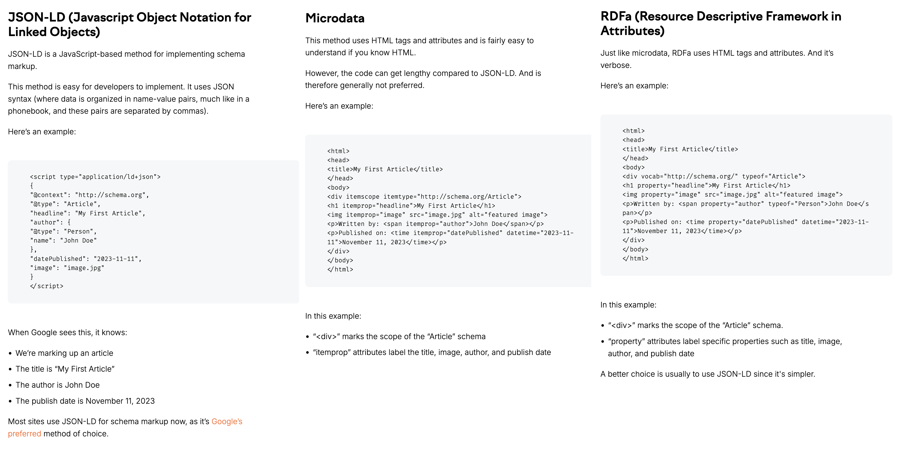
>
>   If you use SEO Optimization tool like Semrush, you can generate the schema markups for your pages with it, and attach itthem to the pages to be compliant with the standards:
>
>   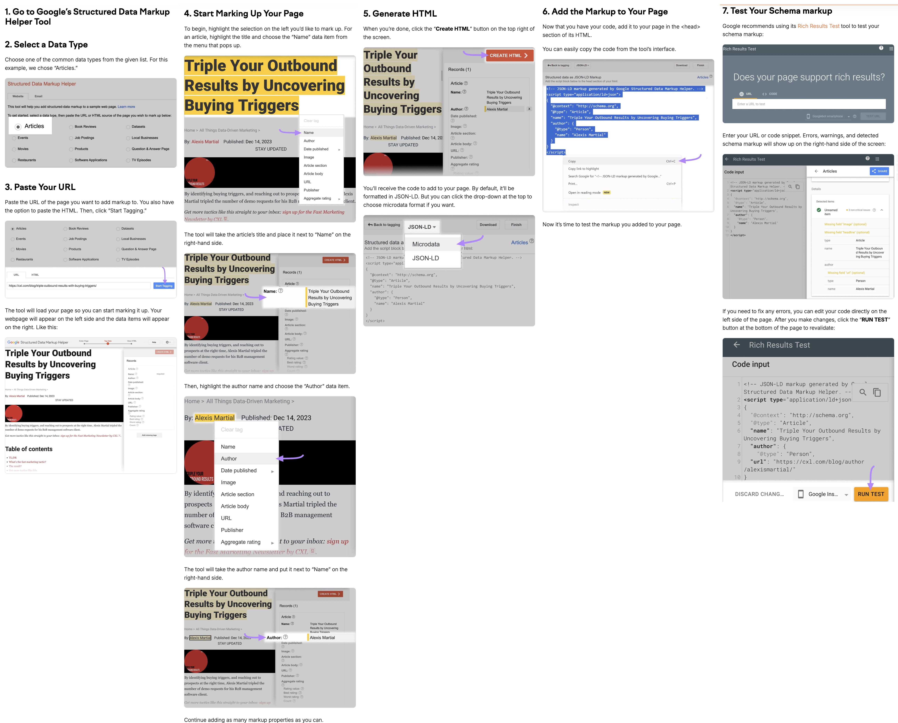
>
>   -- \[[Semrush Blog](https://www.semrush.com/blog/schema-markup/)\]

>   Schema.org markup can be added to any website page. Adding the the **markup using JSON-LD**, doesn't impact the design or speed because it's only data. You can add it to a page directly, using a plugin or with Google Tag Manager. Determining what markup type to add, depends on the page and its content. Here are some common pages and associated markup type.
>
>   | Page Type              | Markup Type (Structured Data Type) | Schema.org Page                                             |
>   | ---------------------- | ---------------------------------- | ----------------------------------------------------------- |
>   | Home / Front Page      | Organisation                       | https://schema.org/Organization                             |
>   | About Us Page          | About                              | https://schema.org/about                                    |
>   | Product / Service Page | Product                            | https://schema.org/Product                                  |
>   | Contact Page           | Article / BlogPosting              | https://schema.org/Article / https://schema.org/BlogPosting |
>   | FAQ Page               | FAQPage                            | https://schema.org/FAQPage                                  |
>
>   -- \[[SMA Marketing](https://www.youtube.com/watch?v=_HFRnsv7wFA)\]

---

## Why is Schema Markup (schema.org) important for SEO ?

>   Google uses structured data to understand the content of your site better and enable Rich Features to your site links within the search results.Research has shown that these features have a significant impact on the click-through-rate of your site. Here are some common Rich Features.
>
>   
>
>   -- \[[SMA Marketing](https://www.youtube.com/watch?v=_HFRnsv7wFA)\]

>   Schema markup is important for SEO **not because it directly impacts your rankings** in search results. But because of its other benefits.
>
>   -   First, schema markup **helps search engines understand the context ** **and content** of your pages more effectively. This improved understanding can lead to your pages being shown for more relevant search queries. Which translates to more traffic.
>   -   Second, schema markup can **enhance the appearance** of your page in search results. This means people are more likely to notice and click on your page. Improving your click-through rate (CTR).
>
>   -   And third, schema can give you a **competitive edge**. Many sites still aren't using schema markup. So when you do, you're getting ahead of the curve. It's a competitive edge that makes your website stand out.
>
>   All these things can contribute to overall better SEO performance for your site.
>
>   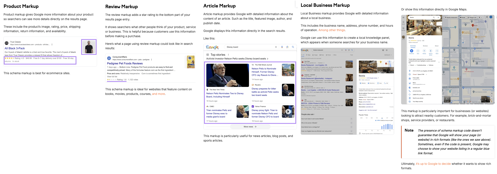
>
>   -- \[[Semrush Blog](https://www.semrush.com/blog/schema-markup/)\]

When your website ('s page) provides structured data that full-fills the minimum schema requirement (may vary depending on different search engine), the search engine is able to display rich-style looking result for you; For example, you may have article being shown as multiple cards, breadcrumbs below your result, or even expand/collapsable FAQ section:

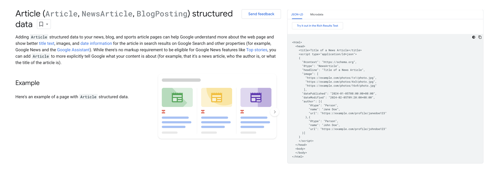

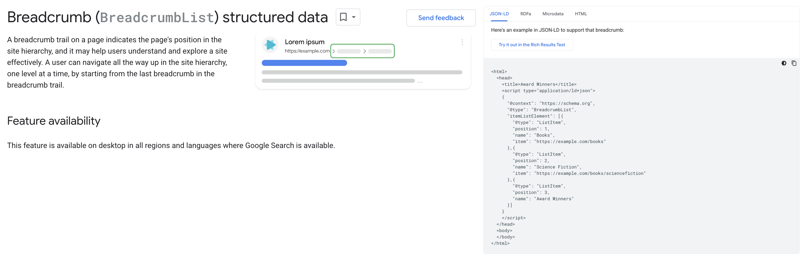

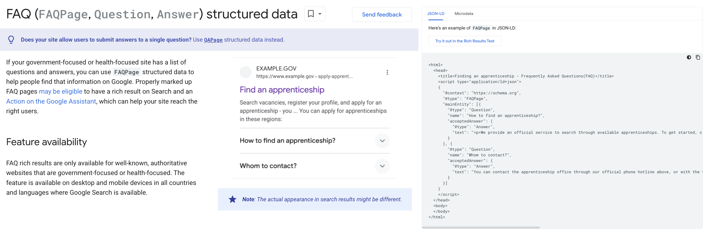

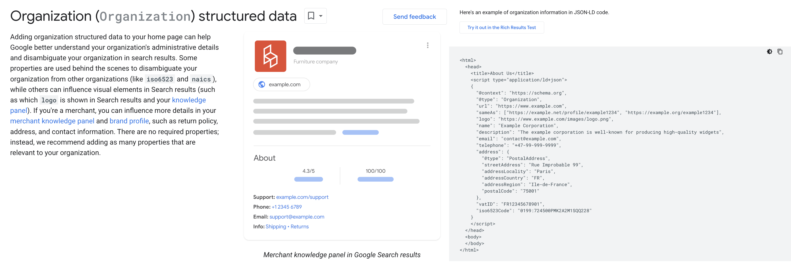

You can find a full list of such rich-style featues Google provides for varies structured data: https://developers.google.com/search/docs/appearance/structured-data/search-gallery

---

## Schema Markup vs Meta Tag ?

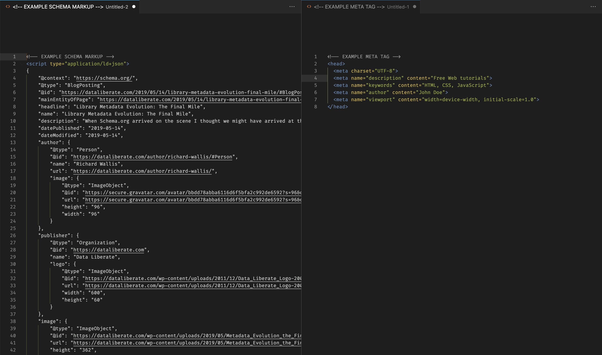

While both meta tags and schema markup are used to provide information to search engines about a webpage, the key difference is that meta tags offer basic descriptive information like page titles and descriptions, while schema markup uses a structured format to convey detailed entity data about the content on a page, allowing search engines to understand the context and display richer snippets in search results.

**Meta tags:**

-   Basic information: Includes elements like title, description, keywords (although less relevant today) which provide a brief summary of the page content.
-   Simple implementation: Easily added to the HTML head section of a webpage using standard meta tags.
-   Limited functionality: Primarily used for basic search engine display and ranking signals.

**Schema Markup:**

-   Strctured data: Uses a defined vocabulary to specify the types of entities on a page, like "product," "event," or "person," along with their attributes (price, date, location).
-   Rich snippets: Enables search engines to display enhanced information in search results, such as star ratings for products or event details
-   Advanced implementation: Requires adding specific code to the HTML using a structured format like JSON-LD or microdata.

In summary, think of meta tags as a **basic introduction** to a webpage, while schema markup provides a **detailed, structured profile of the content**, leading to potentially richer and more informative search results.

---

## Reference

-   [SMA Marketing - A Beginners Guide to Schema.org](https://www.youtube.com/watch?v=_HFRnsv7wFA)
-   [Semrush Blog - What Is Schema Markup & How to Implement It ?](https://www.semrush.com/blog/schema-markup)
-   [Google Search Central - Structured data markup that Google Search supports](https://developers.google.com/search/docs/appearance/structured-data/search-gallery)

-   [LinkedIn - How can you use meta tags and schema markup to optimize video SEO?](https://www.linkedin.com/advice/3/how-can-you-use-meta-tags-schema-markup-7upce#:~:text=In%20summary%2C%20meta%20tags%20refine,to%20interpret%20the%20video's%20context.)

