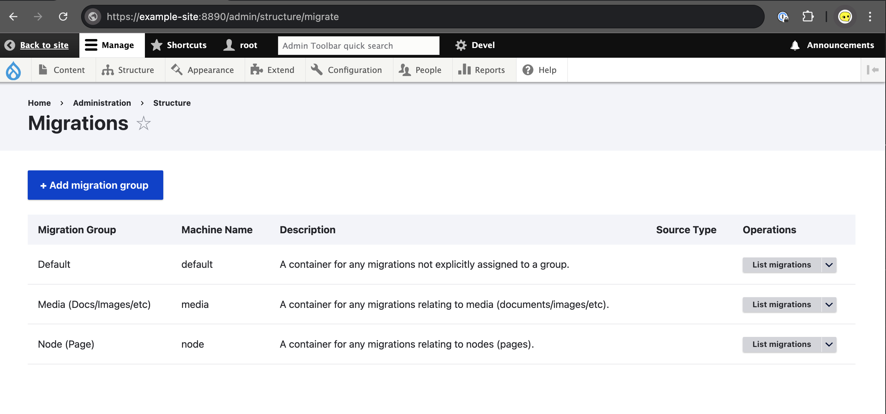
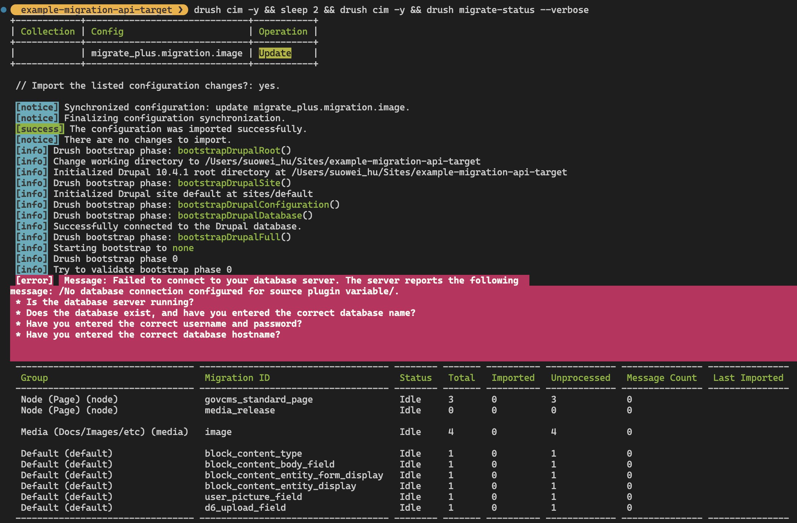

## Intuition

The need to understand this feature of Drupal stems from client requests for the ability to migrate data from JSON:API to Drupal. This includes tasks such as creating nodes or entities and synchronising content based on the API. By having this capability, clients can store sensitive content on their own servers, keeping it private and under their control. They can conduct reviews internally and publish the content via APIwhen ready (either using  Drupal contributed module: [JSON:API](https://www.drupal.org/docs/core-modules-and-themes/core-modules/jsonapi-module), or end-point of their own), using the Migration module to transfer it to the production website. This workflow ensures complete protection against data leaks by avoiding storage on the production server. Additionally, it reduces the risk of errors during the editorial process, which is crucial in scenarios where clients do not fully trust their hosting provider and cannot afford any mistakes with their content.


## Preliminary Setup

#### API Data Source

Firstly, you'll need to have a API servering as the data source of the migration, either:

-   **Drupal JSON:API module**:  implements the JSON:API specification for Drupal entities, offering an opinionated approach that requires no configuration. It enables RESTful CRUD operations for the content of a Drupal site. ([link](https://www.drupal.org/docs/core-modules-and-themes/core-modules/jsonapi-module))
-   **Build your own API**: build your own end-point, for instance, build an route that send a JSON response using Next.js. ([link](https://nextjs.org/docs/pages/building-your-application/routing/api-routes#sending-a-json-response))

-   **Use an Example API**: free fake REST API you can find online, of instance:
    -   https://jsonplaceholder.typicode.com/albums/1/photos
    -   https://www.omdbapi.com/?s=space&type=movie&r=json&apikey=86e4b169

As long as you have an API that provides data in JSON format with an array object representing the data in its body, you can continue on the journey of this tutorial, below is an example of the API using JSON:API module:

```
{
    "jsonapi":{"version":"1.0","meta":{"links":{ "self":{ "href":"http://jsonapi.org/format/1.0/" }}}},
    "links":{"self":{"href":"https://example.com/jsonapi/node/govcms_standard_page?filter%5Btitle-filter%5D%5Bcondition%5D%5Bpath%5D=title&filter%5Btitle-filter%5D%5Bcondition%5D%5Boperator%5D=CONTAINS&filter%5Btitle-filter%5D%5Bcondition%5D%5Bvalue%5D=Page"}}
    "data":[
        {
            "type":"node--govcms_standard_page",
            "id":"000-000-000-000-000-000-0000",
            "attributes":{
                "drupal_internal__nid":7,
                "drupal_internal__vid":156,
				...
                "status":true,
                "title":"HELLO WORLD - STANDARD PAGE",
                "created":"2025-01-24T00:23:53+00:00",
                "changed":"2025-02-05T05:08:23+00:00",
                ...
                "path":{},
                "body":{},
            },
            "links":{},
            "relationships":{}
        },
        { ... },
        { ... },
        { ... },
        { ... },
```

#### Module Installation

Secondly, you need to install the following modules:

-   [**Migrate**](https://www.drupal.org/project/migrate): provides a flexible framework for migrating content into Drupal from other sources (a part of the core)
-   [**Migrate Plus**](https://www.drupal.org/project/migrate_plus): provides extensions to core migration framework functionality, as well as examples.
-   [**Migrate Tools**](https://www.drupal.org/project/migrate_tools): provides tools for running and managing Drupal migrations, including the GUI interface at `/admin/structure/migrate`.

You can do that executing the following in the rooter folder of the project:

```
# [install via composer]
composer require 'drupal/migrate_plus:^6.0'
composer require 'drupal/migrate_tools:^6.0'

# [enable the modules]
drush pm:enable migrate
drush pm:enable migrate_plus
drush pm:enable migrate_tools
```

#### Configuration Management

Thirdly, after enabling the migration related modules, you will need to export your configuration, such that we can get the example `.yml` provided by the migration plus modules, as well as crafting our own migration task and import them back to drupal. You can either:

-   Manually Import/Export Configuration via Drush Utility:
    -   Set configuration path in `settings.php` : `$settings['config_sync_directory'] = 'config/sync';`
    -   Export and Import via: `drush config:import`, `drush config:export`
-   Configura Automatic Configuration Synchronisation on Manage > Configuration > Development > Configuration synchronization (or visiting url `<root>/admin/config/development/configuration`).

In all below section, you will need to perform at least one configuration import/sync whenever you make changes to the  `migrate_plus.migration.***.yml` or  `migrate_plus.migration_group.***.yml` file.


---

## Migration Setup

In the below example we'll utiliize the migrate plus module to create two migration group: `node` and `media` to hold differnet type of migration task; As well as three migration tasks: `standard page`, `media_release`, `image`, and configure each task by definiing its source, target, and process in its  `migrate_plus.migration.***.yml` file.

#### Create Migration Group

Firstly, let's create two different MigrationGroup to hold the upcoming different type of migration task, we do that via first duplicating the example `migrate_plus.migration_group.default.yml` file provided by the migration plus module:

```yml
# [ migrate_plus.migration_group.default.yml ]
uuid: 4ab8a408-b785-4c3d-868f-dc7d028fb853
langcode: en
status: true
dependencies: {  }
id: default
label: Default
description: 'A container for any migrations not explicitly assigned to a group.'
source_type: null
module: null
shared_configuration: null
```

We'll create two groups via two different files:

```yml
# [ migrate_plus.migration_group.node.yml ]
uuid: 4ab8a408-b785-4c3d-868f-dc7d028fb851
langcode: en
status: true
dependencies: {  }
id: node
label: 'Node (Page)'
description: 'A container for any migrations relating to nodes (pages).'
source_type: null
module: null
shared_configuration: null
```

```yml
# [ migrate_plus.migration_group.media.yml ]
uuid: 4ab8a408-b785-4c3d-868f-dc7d028fb859
langcode: en
status: true
dependencies: {  }
id: media
label: 'Media (Docs/Images/etc)'
description: 'A container for any migrations relating to media (documents/images/etc).'
source_type: null
module: null
shared_configuration: null
```

Later-on we can control the migration behaviour of all task within a group at once using the drush Command-Line utility, for instance:

-   `drush migrate-import         --group="node"`
-   `drush migrate-rollback      --group="media"`
-   `drush migrate:reset-status  --group="media"`

*(\*p.s.*

-   *You may either leave the `uuid` field empty when you first create the file, and run `dursh cim` followed by `drush cex`, drupal will automatically assign the `uuid` for the group, or manually enter your `uuid` (please make sure no duplicate)*

-   *Once you are done creating the groups please remember to run `drush cim` to import these changes*


#### Create Migration Task

Secondly, you'll need to create the actual migration tasks via `.yml` file, create the following (you can use the example provided in this post or migrate plus module as starting point):

**Migration Task: GovCMS Standard Page (Built-in Content Type)**

```yml
# ====================================================================================
# [METADATA]
uuid: 5c7ddbd6-cd67-472f-a185-28375206cd2e  # UUID, please make sure no duplicate
langcode: en                                # Language
status: true                                # Enable / disable this migration task
dependencies: {  }                          # Dependencies of this migration task
id: govcms_standard_page                    # The machine_name / unique_identifier of the task
class: null                                 # N/A
field_plugin_method: null                   # N/A
cck_plugin_method: null                     # N/A
migration_tags: null                        # Migration Tags
migration_group: node                       # Migration Group
label: govcms_standard_page                 # User friendly name (nick name)
# ====================================================================================
# [SOURCE (EXTRACT)]
source:
  plugin: url                              # Url as the data source
  data_fetcher_plugin: http                # The data_fetching plugin
  data_parser_plugin: json                 # The data_parser normally limits the fields passed on to the source plugin to fields configured to be used as part of the migration. To support more dynamic migrations, the JSON data parser supports including the original data for the current row.
  include_raw_data: true                   # ↑                      (Simply include the 'include_raw_data' flag set to `true` to enable this. This option is disabled by default to minimize memory footprint for migrations that do not need this capability.)
  headers:                                 # HTTP reqeust header
    Accept: application/json               # ↑
    Content-Type: application/json         # ↑
  urls:                                    # Here we use the JSON:API get request as data source, read more: https://www.drupal.org/docs/core-modules-and-themes/core-modules/jsonapi-module/fetching-resources-get#s-get-article-media-entity-reference-field-image-url-uri-by-including-references
    - 'https://example-source/jsonapi/node/govcms_standard_page/?filter[title-filter][condition][path]=title&filter[title-filter][condition][operator]=CONTAINS&filter[title-filter][condition][value]=EXAMPLE-STANDARD-PAGE-'
    # (optionaly you can provide url in MigrateGroup like the following "shared_configuration: source: urls: 'https://www.omdbapi.com/?s=space&type=movie&r=json&apikey=86e4b169'
  item_selector: data                      # selector to get to the array of the data; You don't need this field if you JSON:API is an array from the root
  # --------------------------------------
  fields:                                  # This is the fiels from the data source
    -                                      # For each one you need to define
      name: source_data_id                    # [name]:      the machine_name for this source
      label: 'Source - DataID'                # [label]:     user friendly name for this source
      selector: id                            # [selector]:  selector to get to this field (after item_slector being applied)
    -
      name: source_drupal_internal__nid
      label: 'Source - NodeID'
      selector: attributes/drupal_internal__nid
    -
      name: source_title
      label: 'Source - TITLE'
      selector: attributes/title
    -
      name: source_body_value
      label: 'Source - BODY VALUE'
      selector: attributes/body/value
    -
      name: source_body_format
      label: 'Source - BODY FORMAT'
      selector: attributes/body/format
    -
      name: source_body_processed
      label: 'Source - BODY FORMAT'
      selector: attributes/body/processed
  # --------------------------------------
  ids:                                   # This is the unique identifier for the individual rows/data-records
    source_data_id:                      # it has to be defined as one of the "fields" (in this examplle either: source_data_id, source_drupal_internal__nid, ...)
      type: string
# ====================================================================================
# [PROCESS (TRANSFORM)]
process:                                               # mapping between the "source fiels" and "destination fields"
  drupal_internal__nid: source_drupal_internal__nid    # map [source_drupal_internal__nid] to [title]
  title: source_title                                  # map [source_title] to [title]
  body/value: source_body_value                        # map [source_body_value]      to [body/value      \
  body/format: source_body_format                      # map [source_body_format]     to [body/format]     ← in case your field is made up of many sub-fields
  body/processed: source_body_processed                # map [source_body_processed]  to [body/processed] /
# ====================================================================================
# [DESTINATION (LOAD)]
destination:                                           # The desitnation
  plugin: 'entity:node'                                #   (where data gets stored)
  default_bundle: page                                 #   the content type using ...
# ====================================================================================
migration_dependencies: {  }

```

**Migration Task: Media Release (Custom Content Type)**

```yml
uuid: 2e631263-2a8d-41e8-9b48-03cf9ef742c3
langcode: en
status: true
dependencies: {  }
id: media_release
class: null
field_plugin_method: null
cck_plugin_method: null
migration_tags: null
migration_group: node
label: 'media_release'
source:
  plugin: url
  data_fetcher_plugin: http
  data_parser_plugin: json
  include_raw_data: true
  headers:
    Accept: application/json
    Content-Type: application/json
  urls:
    - 'https://example-url/jsonapi/node/media_release?filter[drupal_internal__nid]=46'
  item_selector: data
  fields:
    -
      name: source_node_id
      label: 'Source - NodeID'
      selector: attributes/drupal_internal__nid
    -
      name: source_title
      label: 'Source - TITLE'
      selector: attributes/title
  ids:
    source_node_id:
      type: string
process:
  drupal_internal__nid: source_node_id
  title: source_title
destination:
  plugin: 'entity:node'
  default_bundle: media_release
migration_dependencies: {  }
```

**Migration Task: Image (Build-in Media Type)**

```yml
uuid: 5c7ddbd6-cd67-472f-a185-28315206cd2f
langcode: en
status: true
dependencies: {  }
id: image
class: null
field_plugin_method: null
cck_plugin_method: null
migration_tags: null
migration_group: media
label: image
source:
  plugin: url
  data_fetcher_plugin: http
  data_parser_plugin: json
  include_raw_data: true
  headers:
    Accept: application/json
    Content-Type: application/json
  urls:
    - 'https://example-url/jsonapi/media/image?include=field_media_image&fields[file--file]=uri,url&filter[name]=NGINX-EXAMPLE-IMAGE-1'
  item_selector: data
  fields:
    -
      name: source_data_id
      label: 'Source - DataID'
      selector: id
    -
      name: drupal_internal__mid
      label: 'Source - MediaID'
      selector: attributes/drupal_internal__mid
    -
      name: source_name
      label: 'Source - NAME'
      selector: attributes/name
    -
      name: source_field_media_image
      label: 'Source - FIELD MEDIA IMAGAE'
      selector: attributes/field_media_image/related/href
  ids:
    source_data_id:
      type: string
process:
  source_drupal_internal__nid: source_drupal_internal__nid
  name: source_name   # ← Notice here instead of TITLE we are using NAME
destination:
  plugin: 'entity:media'
  default_bundle: image
migration_dependencies: {  }

```

#### Execute/Rollback Migration Task

Once the above configuration for task is created, like before, import it via the `drush cim` command, then you should be able to see it come up both in the admin backend (`admin/structure/migrate`)  and `dursh migrate:status` printout:





(* some time you may get error of "failed to connect to database" or "migration id not found", you'll just have to run the configuration importation command again, and they seem to go away by themselves.

**Execute Migration Import**: you can import the configuration via clicking on the "execute" button on the admin backend (`admin/structure/migrate`) or via running `drush migrate:import --group="node"`.

**Rollback Migration (delete/revert node)**: you can roll back the changes via running `drush migrate:rollback`.


---
## Example Files
- [migrate_plus.migration_group.media.yml](migrate_plus.migration_group.media.yml)
- [migrate_plus.migration_group.node.yml](migrate_plus.migration_group.node.yml)
- [migrate_plus.migration.govcms_standard_page.yml](migrate_plus.migration.govcms_standard_page.yml)
- [migrate_plus.migration.image.yml](migrate_plus.migration.image.yml)
- [migrate_plus.migration.media_release.yml](migrate_plus.migration.media_release.yml)


## Reference

- https://www.drupal.org/docs/8/api/migrate-api/migrate-source-plugins
- https://www.jeffgeerling.com/blog/2016/migrate-custom-json-feed-drupal-8-migrate-source-json
- https://gist.github.com/dinarcon/72922e8cf634ada47483117ffa659d76
- https://nginx-master-rba.govcms5.amazee.io/jsonapi/node/govcms_standard_page
- https://www.drush.org/13.x/commands/migrate_import/
- https://www.omdbapi.com/?s=space&type=movie&r=json&apikey=86e4b169
- https://www.drupal.org/docs/8/api/migrate-api/migrate-process-plugins/list-of-migrate-process-plugins
- https://www.drupal.org/docs/8/api/migrate-api/migrate-process-plugins/migrate-process-overview
- https://github.com/evolvingweb/migrate_example_media/tree/1.x
- https://www.youtube.com/watch?v=93w28CtakKA


