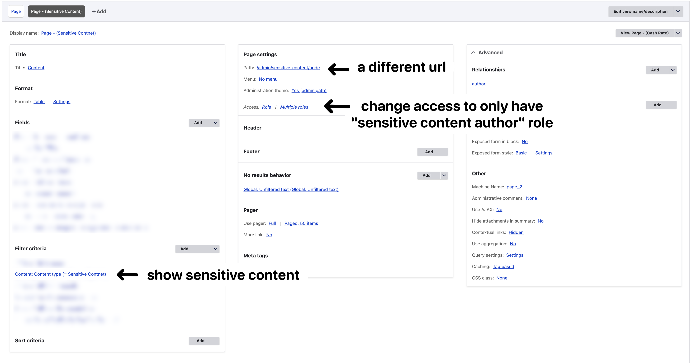

## Intuition
I received an unusual yet reasonable request from a client regarding the **handling of "sensitive content"** in their system. The client wants this specific content type to be visible once published, with strict editorial control limiting modifications to users with specific role permissions. When the content is in a published state, it should be accessible to all users, including those working within the Drupal backend. However, for unpublished content, visibility in the Drupal backend should be restricted exclusively to the user of role "sensitive content author." This creates a clear workflow where content visibility is controlled by publication status while maintaining appropriate access controls throughout the content lifecycle.

The reason that it **CANNOT be done via permission** is because: 1. you can only control the access to the unpublished content on a global level (i.e. either they can see all unpublished content or none) 2. you cannot control the access to the unpublished content on a per content type level

---

## Solution 

### Part-1: present user from accessing unpublished sensitive content

To begin with, we'll need to block any user from seeing the unpublished "sensitive content", do do that we need to add the following in the `<custom-theme-name>.theme` file: 

```php
# Helper function to check if user have access to content
function check_haveAccess_toSensitiveContent() {
    $current_user = \Drupal::currentUser();
    $current_role = $current_user->getRoles()[1] ?? NULL;
    // Check if the user is not logged in
    if ( count($current_user->getRoles())==0) {
        $is_administrator_user  = FALSE;
        $is_sensitiveRole_user  = FALSE;
        $is_root_user           = FALSE;
    }
    // Check if the user is a root user
    else if ( count($current_user->getRoles())==1) {
        $is_administrator_user  = FALSE;
        $is_sensitiveRole_user  = FALSE;
        $is_root_user           = ($current_user->getAccount()->id() == 1);
    } 
    // Check if the user holds a role that should acess to the content 
    // (administrator, or role of machine name that start with sensitive_content_)
    else {
        $is_administrator_user  = (strpos($current_role, 'administrator') !== FALSE);
        $is_sensitiveRole_user  = (strpos($current_role, 'sensitive_content_') !== FALSE);
        $is_root_user           = FALSE;
    }
    return $is_administrator_user OR $is_sensitiveRole_user OR $is_root_user;
}
```

```php
# Helper functions to return either "404 not found" or "403 access denied" page
function redirectTo_404_notFound(&$variables) {
  throw new \Symfony\Component\HttpKernel\Exception\NotFoundHttpException();
}
function redirectTo_403_accessDenited(&$variables) {
    throw new \Symfony\Component\HttpKernel\Exception\AccessDeniedHttpException();
}
```

```php
# override theme_preprocess_node hook
function rba_preprocess_node(&$variables) {
  // Check if this if the current node is a "targed content type" and status is"unpublished"
  if ($variables['node']->bundle() === 'cashrate_content' AND !$variables['node']->isPublished()) {
    // If user doesn't have the required role or node is unpublished, hide the content
    if (!check_haveAccess_toCashRateContent()) {
		redirectTo_403_accessDenited($variables);             // Redirect to 403 page
		redirectTo_404_notFound($variables);                  // Redirect to 404 page
    }
  }
}
```

In case you don't want to redirect to the 404/403 page but instead want to have control over the content in the page, to display message like "You need to be a sensitive content author to see this page", you can also do that via the following: 

```php
function override_title(&$title_variables){
    $title_variables['title'] = 'Access Denied (currently logged in as non-sensitive content user)';
    $title_variables['subtitle'] = '';
}
function override_content(&$node_variables){
    foreach ($node_variables as $key => $value) {if (strpos($key, 'content_') === 0) { $node_variables[$key] = [];}}
    $node_variables['content'] = ['#markup' => '<div class="access-denied-message">' . t('You do not have permission to view this content.  (currently logged in as non-sensitive content user) ') . '</div>',];
    $node_variables['label'] = t(''); $node_variables['page'] = FALSE; $node_variables['title'] = []; $node_variables['elements'] = [];
}
function rba_preprocess_page_title(&$variables) {
  $node = \Drupal::routeMatch()->getParameter('node');
  if ($node->bundle() === 'cashrate_content' AND !$node->isPublished()) {
    if (!check_haveAccess_toCashRateContent()) {
        override_title($variables);                 // [ Override title ]
    }
  }
}
function rba_preprocess_node(&$variables) {
  if ($variables['node']->bundle() === 'cashrate_content' AND !$variables['node']->isPublished()) {
    if (!check_haveAccess_toCashRateContent()) {
        override_content($variables);              // [ Override content ]
    }
  }
}
```


Similarly, we need to also prevent these non-authorised user from `creating`, `editing`, `deleting`, `manipulating the revision` for the "sensitive content" type, and such can be done easily via the permission: **"Admin > People > Permission"** (admin/people/permissions). Simply uncheck for those roles that are not "sensitive content author" nor "site administrator", see below: 


### Part-2: create seprate "senstive content" view in backend

Next, we'll need to hide the unpublished sensitive content via editing the default content view (`/admin/content/node`): 


In the meanwhile also create a new view to store the "sensitive content only" (`/admin/sensitive-content/node`)




